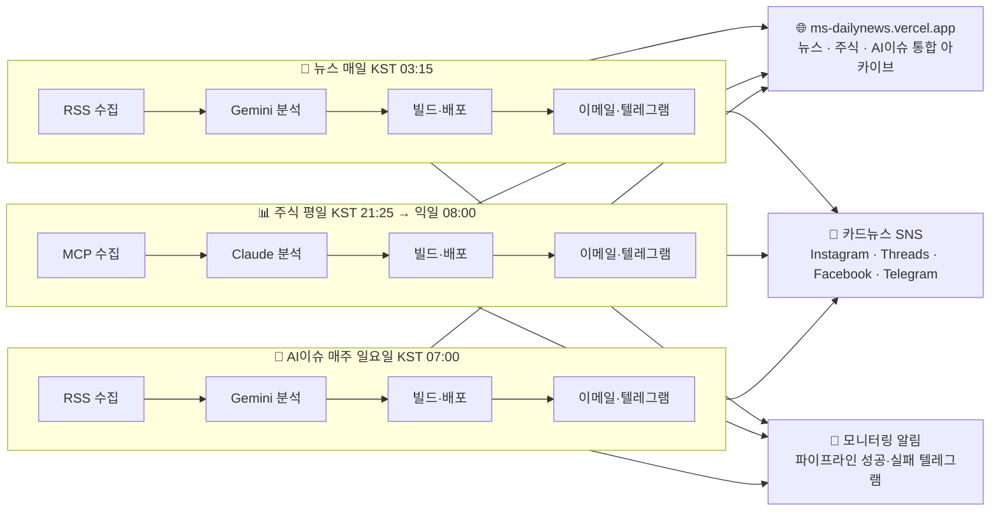
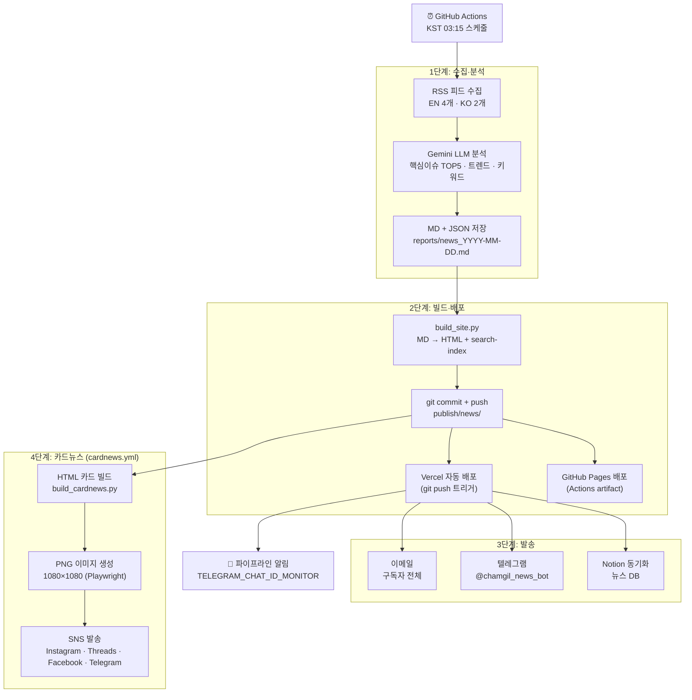
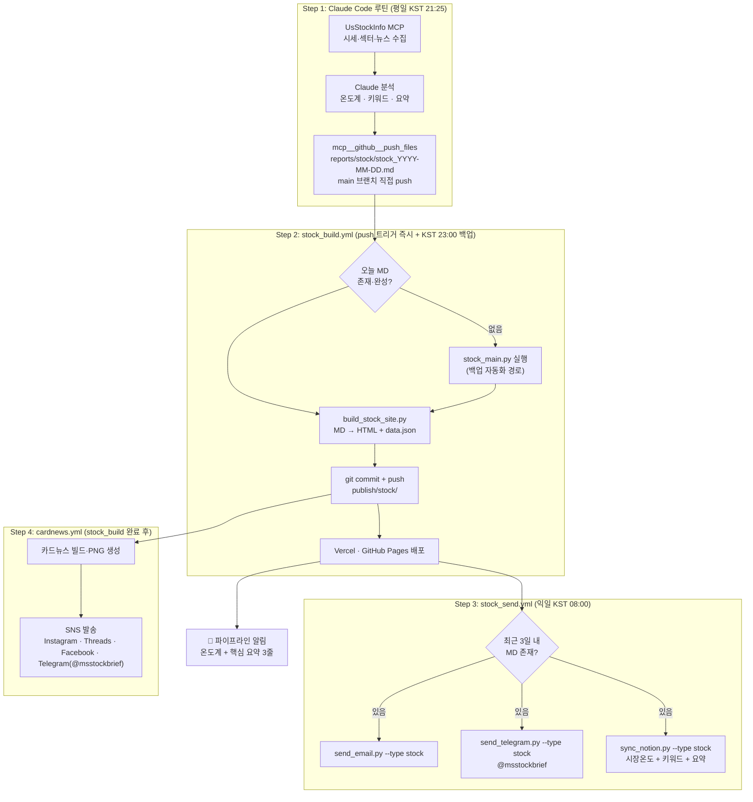
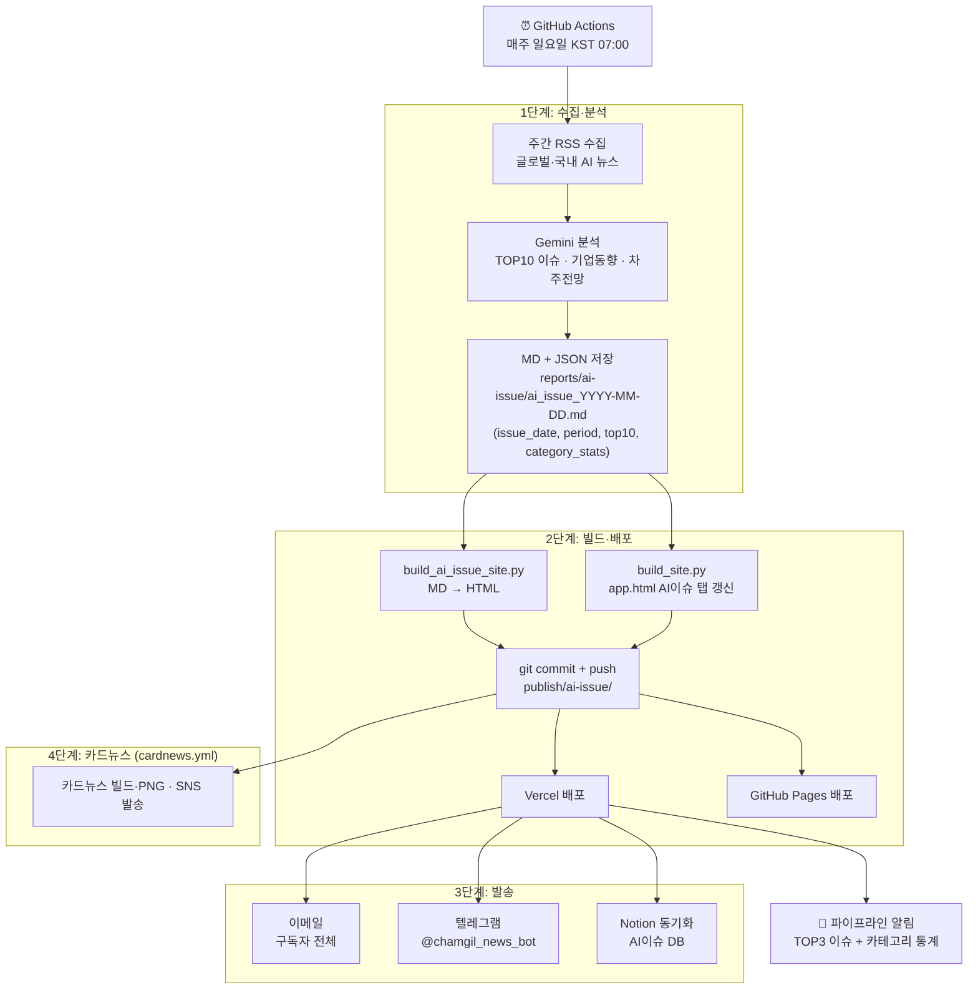
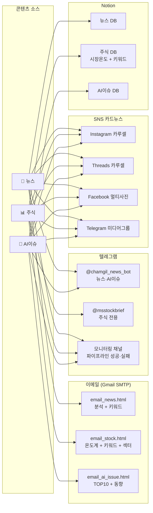
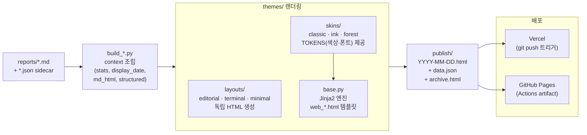

# AI News Brief

[](https://www.python.org/)
[](https://deepmind.google/technologies/gemini/)
[](https://ms-dailynews.vercel.app/)
[](https://chamgil71.github.io/dailynews/)
[](#github-actions--비용)

> **완전 자동화 · 서버리스 3채널 AI 브리핑 시스템**  
> 📰 데일리 뉴스 · 📊 주식시황 · 🤖 AI이슈 주간 브리핑을 자동 수집·분석하여  
> 웹 대시보드 · 이메일 뉴스레터 · 텔레그램 · SNS 카드뉴스로 발행합니다.

---

## 시스템 아키텍처

### Level 1 — 3채널 전체 흐름 한눈에



---

### Level 2 — 채널별 파이프라인 상세

#### 📰 뉴스 브리핑 (`news.yml` · 매일 KST 03:15)



---

#### 📊 주식시황 (`stock_build.yml` + `stock_send.yml`)



---

#### 🤖 AI이슈 주간 브리핑 (`ai_issue.yml` · 매주 일요일 KST 07:00)



---

### Level 3 — 공통 시스템 구조

#### 발송 채널 구성



#### 빌드 → 렌더링 시스템



---

## 주요 기능

| 채널 | 트리거 | AI 모델 | 발송 |
|------|--------|---------|------|
| 📰 뉴스 브리핑 | 매일 KST 03:15 (GitHub Actions) | Gemini 2.5 Flash | 이메일 · 텔레그램 · 카드뉴스 SNS |
| 📊 주식시황 | 평일 KST 21:25 (Claude Code 루틴) | Claude Sonnet | 이메일(익일 08:00) · 텔레그램 · Notion |
| 🤖 AI이슈 주간 | 매주 일요일 KST 07:00 (GitHub Actions) | Gemini 2.5 Flash | 이메일 · 텔레그램 · Notion · 카드뉴스 |

- **다이내믹 테마**: `editorial`(신문형) · `classic` · `terminal`(Bloomberg 다크) · `ink` · `forest` · `minimal` — config 1줄 교체
- **구독 시스템**: Supabase 기반 채널별 구독 관리 · HMAC 토큰 구독취소 링크
- **파이프라인 모니터링**: 성공/실패를 별도 텔레그램 채널로 실시간 수신
- **듀얼 배포**: Vercel (메인) + GitHub Pages (백업) 동시 운영

---

## 디렉토리 구조

```
dailynews/
├── .github/workflows/
│   ├── news.yml               # 뉴스 수집·분석·빌드·발송 (매일 KST 03:15)
│   ├── stock_build.yml        # 주식 빌드·배포 (MD push 트리거 + KST 23:00 백업)
│   ├── stock_send.yml         # 주식 발송 이메일·Notion·텔레그램 (익일 KST 08:00)
│   ├── ai_issue.yml           # AI이슈 수집·분석·빌드·발송 (매주 일요일 KST 07:00)
│   └── cardnews.yml           # 카드뉴스 빌드·PNG·SNS 발송 (3채널 push 트리거)
│
├── config/
│   ├── theme_config.py        # 테마·사이트 제목·URL 중앙 설정 (핵심)
│   ├── settings.py            # 환경변수 로드
│   ├── watchlist.yaml         # 주식 감시 종목
│   ├── cardnews_themes.json   # 카드뉴스 채널별 색상·레이블·해시태그
│   └── sources/               # RSS 소스 목록 (EN·KO·AI이슈)
│
├── core/
│   ├── news/                  # 뉴스 수집(collector) · 분석(analyzer) · 리포트
│   ├── stock/                 # 주식 수집 · 분석 · 리포트
│   ├── ai_issue/              # AI이슈 수집 · 분석
│   └── shared/
│       ├── mailer.py          # 이메일 발송 (3채널 공통, Supabase 구독자 조회)
│       └── telegram.py        # 텔레그램 발송 (3채널 공통)
│
├── themes/
│   ├── layouts/               # 레이아웃 테마 (독립 HTML 생성)
│   │   ├── editorial.py       # 신문 마스트헤드 (현재 기본)
│   │   ├── terminal.py        # Bloomberg 다크
│   │   └── minimal.py         # 여백 중심
│   ├── skins/                 # 스킨 테마 (색상·폰트 TOKENS만)
│   │   ├── classic.py         # 남색 카드 레이아웃
│   │   ├── ink.py             # 붉은 accent 신문
│   │   └── forest.py          # 에메랄드 핀테크
│   ├── base.py                # Jinja2 렌더링 엔진 (skins용)
│   └── __init__.py            # load_theme() — layouts/ → skins/ 순 탐색
│
├── templates/
│   ├── email_news.html        # 뉴스 이메일 (분석·키워드 2단 레이아웃)
│   ├── email_stock.html       # 주식 이메일 (온도계·키워드·섹터)
│   ├── header.html            # 상단 네비게이션 (공통)
│   ├── footer.html            # 하단 푸터 (공통)
│   ├── web_news.html          # 뉴스 웹 (skins용)
│   ├── web_stock.html         # 주식 웹
│   └── cardnews_card.css      # 카드뉴스 공통 CSS
│
├── scripts/
│   ├── build_site.py          # 뉴스 MD → HTML + app.html NAV_INJECT
│   ├── build_stock_site.py    # 주식 MD → HTML + data.json
│   ├── build_ai_issue_site.py # AI이슈 MD → HTML + archive
│   ├── build_cardnews.py      # 카드뉴스 HTML 빌드 (--type news|ai-issue|stock)
│   ├── generate_cardnews_images.py  # HTML → PNG 1080×1080 (Playwright)
│   ├── post_cardnews.py       # SNS 멀티플랫폼 발송
│   ├── send_email.py          # 통합 이메일 발송 (--type news|stock|ai-issue)
│   ├── send_telegram.py       # 통합 텔레그램 발송 (--type news|stock|ai-issue)
│   ├── notify_pipeline.py     # 파이프라인 모니터링 알림 (성공·실패)
│   ├── sync_notion.py         # Notion 동기화 (3채널 공통)
│   └── run_ai_issue.py        # AI이슈 수집·분석 실행
│
├── api/                       # Vercel 서버리스 함수
│   ├── subscribe.py           # 구독 신청
│   ├── confirm.py             # 이메일 확인
│   ├── unsubscribe.py         # 구독 취소 (HMAC 토큰)
│   └── manage.py              # 구독 채널 관리
│
├── reports/
│   ├── news_YYYY-MM-DD.md     # 뉴스 일별 리포트
│   ├── news_YYYY-MM-DD.json   # 뉴스 구조화 데이터 (issues, trends, category_stats)
│   ├── stock/
│   │   └── stock_YYYY-MM-DD.md
│   └── ai-issue/
│       ├── ai_issue_YYYY-MM-DD.md
│       └── ai_issue_YYYY-MM-DD.json   # top10, period, category_stats
│
└── publish/                   # 배포 대상 (Vercel + GitHub Pages)
    ├── index.html             # 메인 SPA (app.html 컴파일)
    ├── app.html               # SPA 원본 (build_site.py NAV_INJECT)
    ├── archive.html           # 통합 아카이브 (뉴스·주식·AI이슈 3탭)
    ├── subscribe.html         # 구독 페이지
    ├── news/YYYY-MM-DD.html
    ├── stock/YYYY-MM-DD.html
    ├── ai-issue/YYYY-MM-DD.html
    └── cardnews/
        ├── news/YYYY-MM-DD-{N}.png + data.json
        ├── ai-issue/
        └── stock/
```

---

## 빠른 시작

### 1. 패키지 설치

```bash
pip install -r requirements.txt
```

### 2. 환경변수 설정

```bash
cp .env.example .env
# .env 편집: API 키, Gmail, Telegram, Supabase 등 입력
```

주요 환경변수:

```dotenv
LLM_PROVIDER=gemini
GEMINI_API_KEY=...
GMAIL_USER=your@gmail.com
GMAIL_APP_PASSWORD=...           # Gmail 앱 비밀번호 (16자리)
TELEGRAM_BOT_TOKEN=...
TELEGRAM_CHAT_ID=...             # 뉴스·AI이슈 채널
TELEGRAM_CHAT_ID_STOCK=...       # 주식 전용 채널
TELEGRAM_CHAT_ID_MONITOR=...     # 파이프라인 모니터링 채널
SITE_BASE_URL=https://ms-dailynews.vercel.app
SUPABASE_SERVICE_KEY=...         # 구독 시스템 (Vercel 환경변수에도 등록)
```

### 3. 로컬 실행

```bash
# 뉴스 수집·분석
python main.py

# 사이트 빌드 (MD → HTML)
python scripts/build_site.py

# 카드뉴스 빌드 + PNG 생성
python scripts/build_cardnews.py --type news
python scripts/generate_cardnews_images.py --type news

# 파이프라인 알림 테스트
python scripts/notify_pipeline.py --type news --status success --date $(date +%Y-%m-%d)
```

---

## 테마 설정

`config/theme_config.py` 한 줄 변경으로 전체 대시보드 디자인 교체:

```python
SITE_THEME = "editorial"  # editorial | classic | terminal | minimal | ink | forest
```

| 테마 | 특징 | 폰트 |
|------|------|------|
| `editorial` | 신문 마스트헤드, 우아한 지면 감성 (기본) | Noto Serif KR |
| `classic` | 남색 헤더, 정돈된 카드 레이아웃 | 시스템 폰트 |
| `terminal` | Bloomberg 다크, 개발자 감성 | JetBrains Mono |
| `minimal` | 넓은 여백, 오렌지 accent | 시스템 폰트 |
| `ink` | 붉은 accent, 신문 느낌 | 시스템 폰트 |
| `forest` | 에메랄드 accent, 핀테크 스타일 | 시스템 폰트 |

---

## GitHub Actions & 비용

| 서비스 | 플랫폼 | 비용 | 비고 |
|--------|--------|------|------|
| 뉴스 수집·분석·발송 | GitHub Actions | **$0** | 매일 KST 03:15 |
| 주식 빌드·배포 | GitHub Actions | **$0** | MD push 트리거 + KST 23:00 백업 |
| 주식 발송 (이메일·텔레그램) | GitHub Actions | **$0** | 익일 KST 08:00 |
| AI이슈 주간 브리핑 | GitHub Actions | **$0** | 매주 일요일 KST 07:00 |
| 카드뉴스 SNS 발송 | GitHub Actions | **$0** | 3채널 push 트리거 |
| LLM 분석 | Google Gemini API | **$0** | 무료 티어 범위 내 |
| 정적 호스팅 + API | Vercel + GitHub Pages | **$0** | 글로벌 CDN |
| 이메일 발송 | Gmail SMTP | **$0** | 일일 허용량 내 |
| 구독 DB | Supabase | **$0** | 무료 플랜 |
| **합계** | | **$0 / 월** | |

---

## 관련 문서

| 문서 | 내용 |
|------|------|
| [아키텍처 상세](docs/architecture.md) | 테마 시스템, 렌더링 경로, 배포 흐름 심화 |
| [환경변수 명세](docs/env_spec.md) | 전체 환경변수 목록 (GitHub Secrets vs Vercel) |
| [스크립트 가이드](docs/scripts_guide.md) | 21개 스크립트 역할·사용법·워크플로우 매핑 |
| [SNS 카드뉴스 가이드](docs/sns_design_guide.md) | 5개 플랫폼 발송 방식·캡션·환경변수 |
| [주식 루틴](docs/stock_routine.md) | Claude Code 루틴 단계별 가이드 |
| [테마 디자인 가이드](docs/theme_design_guide.md) | 테마 구조, 커스터마이징 방법 |
