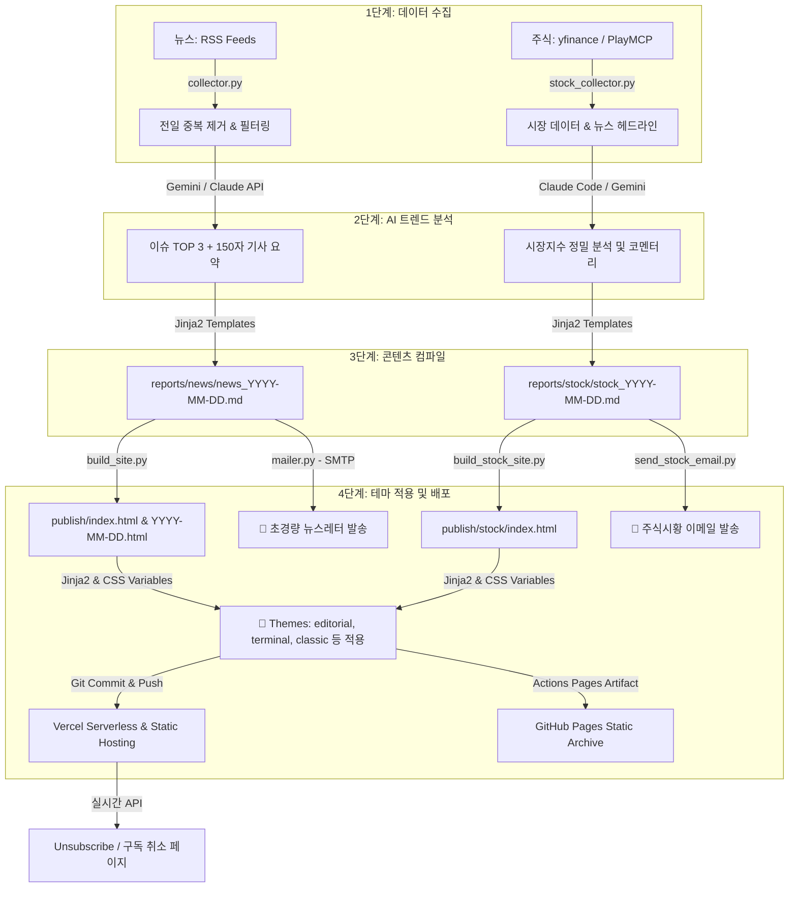

# 📰 AI Daily Intelligence (News & Stock Briefing)

[](https://www.python.org/)
[](https://deepmind.google/technologies/gemini/)
[](https://ms-dailynews.vercel.app/)
[](https://chamgil71.github.io/dailynews/)
[](#github-actions-및-비용)

> **완전 자동화 · 초경량 서버리스 · 월 $0 비용**  
> 매일 아침 RSS 뉴스를 수집해 AI가 트렌드를 분석하고, 매일 장 마감 후 주식 시황을 정밀 요약하여 **고품격 반응형 웹 대시보드**와 **개인화된 이메일 뉴스레터**로 동시에 발행하는 지능형 통합 브리핑 시스템입니다.

---

## 📌 주요 특징 (Key Features)

* **📰 데일리 뉴스 브리핑**: RSS 피드(영어 4개, 한국어 2개 카테고리)를 매일 아침 자동 파싱하여 AI(Gemini, Claude 등)로 핵심 이슈 TOP 3 및 요약문을 도출합니다.
* **📊 주식시황 브리핑**: 장 마감 후 국내외 시장 데이터를 수집하여 분석 리포트를 생성합니다. Claude Code 루틴(주) 및 GitHub Actions 자동화(백업)의 강력한 듀얼 패스를 지원합니다.
* **🎨 프리미엄 다이내믹 테마**: 구조(HTML templates)와 시각 디자인(Theme CSS Variables)을 완전히 격리하여 `classic`, `editorial`(고품격 신문형), `terminal`(다크 블룸버그형), `ink`, `forest`, `minimal` 등 다양한 테마로 즉시 스위칭됩니다.
* **📱 고품격 웹 UX**: 
  - **아코디언 아키브**: 깔끔한 첫인상을 위해 개별 기사 목록은 기본적으로 접힌 상태(`display: none;`)로 제공되며 클릭 시 부드럽게 확장됩니다.
  - **150자 요약문(Summary)**: 각 기사 본문의 핵심이 우아한 인용구 스타일(좌측 보더 및 Muted 톤)로 하이라이팅 처리되어 제공됩니다.
  - **실시간 검색**: 대시보드 내 검색 기능을 통해 기사 제목 및 요약문 내부 키워드까지 완벽히 필터링하며 `mark` 하이라이팅이 지원됩니다.
* **📧 미니멀 메일 템플릿**: HTML 메일 클라이언트 특성을 고려해 CSS 변수 대신 인라인 스타일로 렌더링되며, 불필요하게 무거워지는 것을 방지하기 위해 **기사 상세 목록을 원천 제외한 초경량 분석 요약본**만 발송(웹 대시보드 이동 유도)합니다.
* **🔄 Vercel & GitHub Pages 듀얼 배포**:
  - **Vercel [메인]**: 정적 웹 호스팅과 함께 서버리스 API(`api/unsubscribe.py`)를 통해 **실시간 메일 구독 취소 기능**을 원활히 제공합니다.
  - **GitHub Pages [백업]**: GitHub Actions 워크플로우에 연동된 고가용성 정적 아카이브 페이지를 퍼블리싱합니다.

---

## ⚙️ 시스템 아키텍처 (Architecture)

### 1. 데이터 흐름도



### 2. 핵심 디자인 및 설계 원칙

1. **중앙 집중식 설정 (`config/theme_config.py`)**: 전체 레이아웃 테마 및 타이틀, 도메인 URL 등을 한 곳에서 관리하여 코드 수정 없이 전체 서비스를 변경합니다.
2. **구조, 테마, 콘텐츠의 완전 분리**:
   - **Structure (Jinja2 Templates)**: 웹/이메일의 기본 마크업 골격 정의
   - **Theme (`themes/*.py`)**: 색상 및 폰트 CSS 토큰 정의
   - **Content (`reports/*.md`)**: 순수한 수집 데이터와 AI 분석 텍스트
3. **이메일 호환성 보장**: 이메일 클라이언트의 모던 CSS 미지원 한계를 우회하기 위해 빌드 타임에 Python에서 직접 CSS 테마 사전을 인라인 스타일 속성(`{{ c.navy }}` 등)으로 치환 및 삽입합니다.

---

## 📂 디렉토리 구조 (Directory Structure)

```
dailynews/
├── .github/workflows/         # GitHub Actions 워크플로우 (news.yml, stock_build.yml)
├── api/                       # Vercel용 서버리스 API (unsubscribe.py 구독취소 처리)
├── config/                    # 중앙 설정 및 소스 관리
│   ├── theme_config.py        # 🎨 테마 및 글로벌 변수 (핵심)
│   ├── settings.py            # 환경변수 로딩 및 시스템 셋업
│   ├── watchlist.yaml         # 주식 감시 종목 구성
│   └── sources/               # RSS 수집 대상 목록 (한/영 카테고리)
├── core/                      # 비즈니스 로직
│   ├── news/                  # 뉴스 수집/분석/리포트 생성 모듈
│   ├── stock/                 # 주식 수집/분석/리포트 생성 모듈
│   └── shared/                # 공통 메일링 모듈 (mailer.py)
├── themes/                    # 색상 변수 및 레이아웃 스킨
│   ├── editorial.py           # 📰 현재 기본: 감성적인 신문 사설 스타일 (Noto Serif KR)
│   ├── classic.py             # 💙 깔끔한 네이비 컬러의 카드형 레이아웃
│   ├── terminal.py            # 📟 블룸버그 느낌의 다크 모노스페이스 스타일
│   ├── base.py                # 표준 테마 렌더링 추상 클래스
│   └── ink.py / forest.py...  # 그 외 다양한 액센트 컬러 테마
├── templates/                 # HTML 및 Markdown 기본 뼈대 (Jinja2)
│   ├── web_news.html          # 뉴스 웹용 템플릿
│   ├── email_news.html        # 뉴스 이메일용 템플릿 (초경량 아코디언 제외 버전)
│   └── daily_report.md        # 수집 및 분석 마크다운 템플릿
├── reports/                   # 자동 생성된 원본 Markdown 리포트 아카이브
├── publish/                   # 최종 컴파일된 정적 배포본 (GitHub Pages & Vercel 소스)
├── scripts/                   # 빌드 및 발송 수동/백업 자동 실행용 CLI 스크립트
├── requirements.txt           # 파이썬 의존성 목록
└── vercel.json                # Vercel 라우팅 및 서버리스 API 매핑 규칙
```

---

## ⚡ 빠른 시작 (Getting Started)

### 1. 패키지 설치
로컬 실행을 위해 먼저 의존성 라이브러리를 설치합니다.
```bash
pip install -r requirements.txt
```

### 2. 환경 변수 설정
`.env.example` 파일을 복사하여 `.env` 파일을 생성하고 적절한 크레덴셜을 설정합니다.
```bash
cp .env.example .env
```

```dotenv
# LLM API 키 설정 (Gemini 기본값)
LLM_PROVIDER=gemini
GEMINI_API_KEY=AIzaSyYourGeminiApiKeyHere...

# 이메일 발송 설정 (Gmail SMTP 사용)
GMAIL_USER=your_account@gmail.com
GMAIL_APP_PASSWORD=abcd1234efgh5678 # 16자리 Gmail 앱 비밀번호
RECIPIENT_EMAILS=recipient1@example.com,recipient2@example.com

# 호스팅 도메인 설정 (구독취소 API와 연계)
SITE_BASE_URL=https://ms-dailynews.vercel.app
```

### 3. 로컬 테스트 및 컴파일

**뉴스 파싱 및 메일 발송 전체 프로세스 실행:**
```bash
python main.py
```

**정적 사이트 빌드 (Markdown -> HTML 컴파일):**
```bash
python scripts/build_site.py
```

**로컬 프리뷰 호스팅 (격리 프리뷰 디렉토리 `local_preview/` 기준):**
```bash
python -m http.server 8000 --directory local_preview
# 브라우저에서 http://localhost:8000 접속 후 확인
```

---

## 🎨 테마 스위칭 및 색상 설정

`config/theme_config.py` 파일의 설정을 변경하여 즉시 전체 대시보드의 비주얼 컨셉을 전환할 수 있습니다.

```python
# config/theme_config.py
SITE_THEME = "editorial"  # classic, editorial, terminal, minimal, ink, forest 중 택 1
```

* **Classic**: 깔끔한 뱅킹 및 테크 스타일. 네이비 블루 톤과 정돈된 카드로 신뢰감을 줍니다.
* **Editorial**: 감성적인 지면 신문 레이아웃. 명조 폰트(`Noto Serif KR`)와 우아한 자간/행간을 적용하여 읽기 편안한 미디엄 감성을 전달합니다.
* **Terminal**: 개발자를 위한 다크 Bloomberg 스타일. 모노스페이스 폰트(`JetBrains Mono`)와 네온 그린 액센트로 전문적인 시황 판독기 느낌을 줍니다.

---

## 🚀 GitHub Actions 및 비용

매일 정해진 시간에 완전 무상으로 구동되는 프리미엄 서버리스 자동화 비용 구성입니다.

| 서비스 구성 | 제공 플랫폼 | 사용 요금 | 설명 |
| :--- | :--- | :--- | :--- |
| **뉴스 수집 및 발송** | GitHub Actions | **$0** | 매일 오전 8시 KST (UTC 23:00) Cron 스케줄로 완전 자동 구동 |
| **트렌드 요약 AI** | Google Gemini API | **$0** | Gemini-1.5-flash 무료 티어 범위 내에서 1일 1회 호출 |
| **정적 호스팅 및 API** | Vercel & GitHub Pages | **$0** | 초고속 글로벌 CDN 및 파이썬 서버리스 실행 무료 |
| **뉴스레터 송신** | Gmail SMTP | **$0** | 일일 허용량 내 개인 뉴스레터 전송 무료 |
| **합계** | - | **$0 / 월** | **완전 무료 유지보수 보장** |

---

## 🔗 관련 상세 문서

* [📰 데일리 뉴스 가이드](docs/news_readme.md) — 뉴스 파이프라인 및 아코디언 UX 설명
* [📊 주식시황 가이드](docs/stock_readme.md) — 듀얼 트랙(Claude Code / GitHub Actions) 운영법
* [🧱 아키텍처 상세 설계](docs/architecture.md) — 모듈 설계, 렌더러 동작 방식 및 파일 맵
* [📝 개발 작업 로그](docs/worklog.md) — 업데이트 히스토리 및 주요 기능 변경 이력
