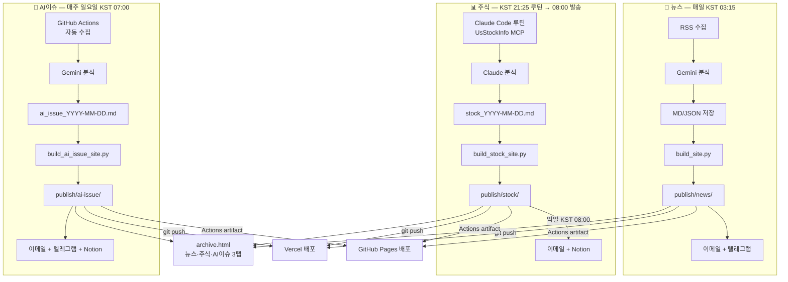

# 📰 AI News Brief

[](https://www.python.org/)
[](https://deepmind.google/technologies/gemini/)
[](https://ms-dailynews.vercel.app/)
[](https://chamgil71.github.io/dailynews/)
[](#github-actions-및-비용)

> **완전 자동화 · 서버리스 3채널 AI 브리핑 시스템**  
> 📰 데일리 뉴스 + 📊 주식시황 + 🤖 AI이슈 주간 브리핑을 자동 수집·분석하여  
> 웹 대시보드 · 이메일 뉴스레터 · 텔레그램으로 동시 발행합니다.

---

## 📌 주요 특징 (Key Features)

* **📰 데일리 뉴스 브리핑**: RSS 피드(영어 4개, 한국어 2개)를 매일 새벽 자동 수집 → Gemini 분석 → 이메일 + 텔레그램 발행 (KST 03:15, GitHub Actions)
* **📊 주식시황 브리핑**: 장 마감 후 Claude Code 루틴이 UsStockInfo MCP로 데이터 수집 → 분석 → push. 다음날 KST 08:00 이메일 발송 (stock_send.yml)
* **🤖 AI이슈 주간 브리핑**: 매주 일요일 KST 07:00 GitHub Actions 자동 실행 → Gemini 수집·분석 → 이메일 + 텔레그램
* **🎨 다이내믹 테마**: `classic`, `editorial`(신문형), `terminal`(Bloomberg 다크), `ink`, `forest`, `minimal` — config 한 줄로 전체 교체 (모든 테마에서 3채널 통합 아카이브 탭 및 실시간 검색 완벽 동기화 지원)
* **📧 이메일 + 텔레그램**: 3채널 모두 이메일 발송 구현. 뉴스·AI이슈는 텔레그램 카드뉴스도 연동
* **🔄 Vercel & GitHub Pages 듀얼 배포**: Vercel (메인, git push 트리거) + GitHub Pages (백업, Actions artifact)

---

## ⚙️ 시스템 아키텍처 (Architecture)

### 1. 데이터 흐름도



### 2. 핵심 디자인 및 설계 원칙

1. **중앙 집중식 설정 (`config/theme_config.py`)**: 전체 레이아웃 테마 및 타이틀, 도메인 URL 등을 한 곳에서 관리하여 코드 수정 없이 전체 서비스를 변경합니다.
2. **구조, 테마, 콘텐츠의 완전 분리**:
   - **Structure (Jinja2 Templates)**: 웹/이메일의 기본 마크업 골격 정의
   - **Theme (`themes/*.py`)**: 색상 및 폰트 CSS 토큰 정의
   - **Content (`reports/*.md`)**: 순수한 수집 데이터와 AI 분석 텍스트
3. **이메일 호환성 보장**: 이메일 클라이언트의 모던 CSS 미지원 한계를 우회하기 위해 빌드 타임에 Python에서 직접 CSS 테마 사전을 인라인 스타일 속성(`{{ c.navy }}` 등)으로 치환 및 삽입합니다.

---

## 📂 디렉토리 구조 (Directory Structure)

```
dailynews/
├── .github/workflows/
│   ├── news.yml               # 뉴스 자동화 (KST 03:15 매일)
│   ├── stock_build.yml        # 주식 빌드 (stock MD push 트리거 + KST 23:00 백업)
│   ├── stock_send.yml         # 주식 발송 (익일 KST 08:00)
│   └── ai_issue.yml           # AI이슈 주간 (일요일 KST 07:00)
├── api/                       # Vercel 서버리스 API (unsubscribe.py)
├── config/
│   ├── theme_config.py        # 테마·사이트 제목·URL 중앙 설정
│   ├── settings.py            # 환경변수 로드 (LLM_PROVIDER, API 키 등)
│   ├── watchlist.yaml         # 주식 감시 종목
│   ├── sources/               # RSS 소스 목록
│   └── ai_issue_sources.py    # AI이슈 수집 소스
├── core/
│   ├── news/                  # 뉴스 수집·분석·리포트
│   ├── stock/                 # 주식 수집·분석·리포트
│   ├── ai_issue/              # AI이슈 수집·분석
│   └── shared/                # mailer, telegram, alerts 공통 모듈
├── themes/                    # 테마 (editorial 기본)
│   ├── editorial.py           # 신문 마스트헤드 (현재 기본)
│   ├── classic.py / terminal.py / ink.py / forest.py / minimal.py
│   └── base.py                # Jinja2 렌더링 엔진
├── templates/                 # HTML/MD 골격 (Jinja2)
├── scripts/
│   ├── build_site.py          # 뉴스 MD → HTML + archive.html
│   ├── build_stock_site.py    # 주식 MD → HTML
│   ├── build_ai_issue_site.py # AI이슈 MD → HTML
│   ├── send_stock_email.py    # 주식 이메일 발송
│   ├── send_ai_issue_email.py # AI이슈 이메일 발송
│   └── sync_notion.py         # Notion 동기화 (3채널 공통)
├── reports/
│   ├── news_YYYY-MM-DD.md
│   ├── stock/stock_YYYY-MM-DD.md
│   └── ai-issue/ai_issue_YYYY-MM-DD.md
├── publish/                   # 배포 대상 (Vercel + GitHub Pages)
│   ├── index.html             # SPA 메인
│   ├── archive.html           # 3탭 아카이브 (뉴스·주식·AI이슈)
│   ├── news/YYYY-MM-DD.html
│   ├── stock/
│   └── ai-issue/
├── requirements.txt
└── vercel.json
```

---

## ⚡ 빠른 시작 (Getting Started)

### 1. 패키지 설치
로컬 실행을 위해 먼저 의존성 라이브러리를 설치합니다.
```bash
pip install -r requirements.txt
```

### 2. 환경 변수 설정
`.env.example` 파일을 복사하여 `.env` 파일을 생성하고 적절한 크레덴셜을 설정합니다.
```bash
cp .env.example .env
```

```dotenv
# LLM API 키 설정 (Gemini 기본값)
LLM_PROVIDER=gemini
GEMINI_API_KEY=AIzaSyYourGeminiApiKeyHere...

# 이메일 발송 설정 (Gmail SMTP 사용)
GMAIL_USER=your_account@gmail.com
GMAIL_APP_PASSWORD=abcd1234efgh5678 # 16자리 Gmail 앱 비밀번호
RECIPIENT_EMAILS=recipient1@example.com,recipient2@example.com

# 호스팅 도메인 설정 (구독취소 API와 연계)
SITE_BASE_URL=https://ms-dailynews.vercel.app
```

### 3. 로컬 테스트 및 컴파일

**뉴스 파싱 및 메일 발송 전체 프로세스 실행:**
```bash
python main.py
```

**정적 사이트 빌드 (Markdown -> HTML 컴파일):**
```bash
python scripts/build_site.py
```

**로컬 프리뷰 호스팅 (격리 프리뷰 디렉토리 `local_preview/` 기준):**
```bash
python -m http.server 8000 --directory local_preview
# 브라우저에서 http://localhost:8000 접속 후 확인
```

---

## 🎨 테마 스위칭 및 색상 설정

`config/theme_config.py` 파일의 설정을 변경하여 즉시 전체 대시보드의 비주얼 컨셉을 전환할 수 있습니다.

```python
# config/theme_config.py
SITE_THEME = "editorial"  # classic, editorial, terminal, minimal, ink, forest 중 택 1
```

* **Classic**: 깔끔한 뱅킹 및 테크 스타일. 네이비 블루 톤과 정돈된 카드로 신뢰감을 줍니다.
* **Editorial**: 감성적인 지면 신문 레이아웃. 명조 폰트(`Noto Serif KR`)와 우아한 자간/행간을 적용하여 읽기 편안한 미디엄 감성을 전달합니다.
* **Terminal**: 개발자를 위한 다크 Bloomberg 스타일. 모노스페이스 폰트(`JetBrains Mono`)와 네온 그린 액센트로 전문적인 시황 판독기 느낌을 줍니다.

---

## 🚀 GitHub Actions 및 비용

매일 정해진 시간에 완전 무상으로 구동되는 프리미엄 서버리스 자동화 비용 구성입니다.

| 서비스 구성 | 제공 플랫폼 | 사용 요금 | 설명 |
| :--- | :--- | :--- | :--- |
| **뉴스 수집 및 발송** | GitHub Actions | **$0** | 매일 KST 03:15 (UTC 18:15) 자동 실행 |
| **주식 빌드·발송** | GitHub Actions | **$0** | push 트리거 즉시 빌드, 익일 KST 08:00 발송 |
| **AI이슈 주간 브리핑** | GitHub Actions | **$0** | 매주 일요일 KST 07:00 자동 실행 |
| **트렌드 요약 AI** | Google Gemini API | **$0** | 무료 티어 범위 내 사용 |
| **정적 호스팅 및 API** | Vercel & GitHub Pages | **$0** | 초고속 글로벌 CDN 및 파이썬 서버리스 실행 무료 |
| **뉴스레터 송신** | Gmail SMTP | **$0** | 일일 허용량 내 개인 뉴스레터 전송 무료 |
| **합계** | - | **$0 / 월** | **완전 무료 유지보수 보장** |

---

## 🔗 관련 상세 문서

* [📰 뉴스 README](docs/news_readme.md) — 뉴스 파이프라인, 빠른 시작
* [📰 뉴스 개발자 가이드](docs/news_guide.md) — 코드 구조, 수집·분석·빌드 상세
* [📊 주식 README](docs/stock_readme.md) — 주식 파이프라인, Claude Code 루틴 설정
* [📊 주식 개발자 가이드](docs/stock_guide.md) — 코드 구조, 워크플로우 상세
* [🧱 아키텍처](docs/architecture.md) — 전체 설계, 테마 시스템, 디렉토리 구조
* [🗺️ 링크 맵](docs/link_map.md) — 페이지 네비게이션, JSON 데이터 흐름도
* [📝 작업 로그](docs/worklog.md) — 변경 이력
