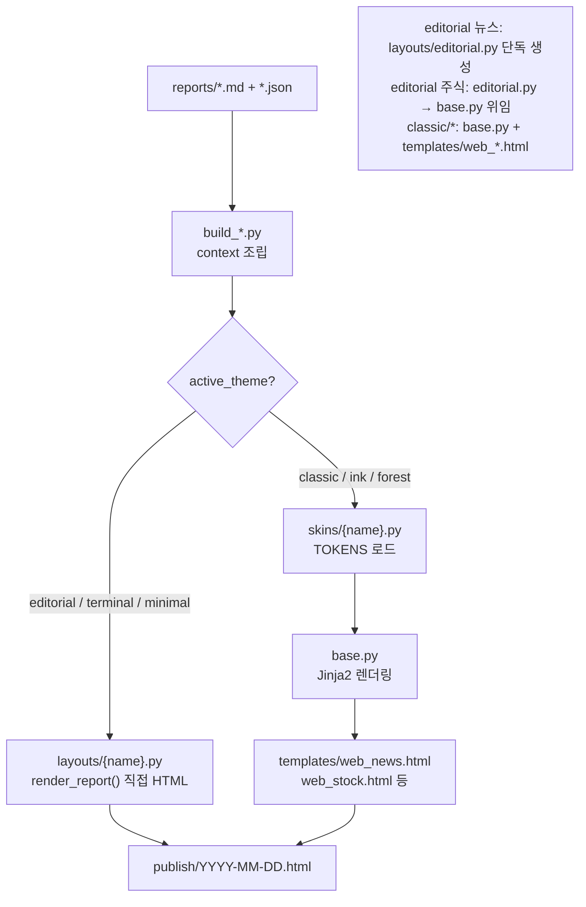
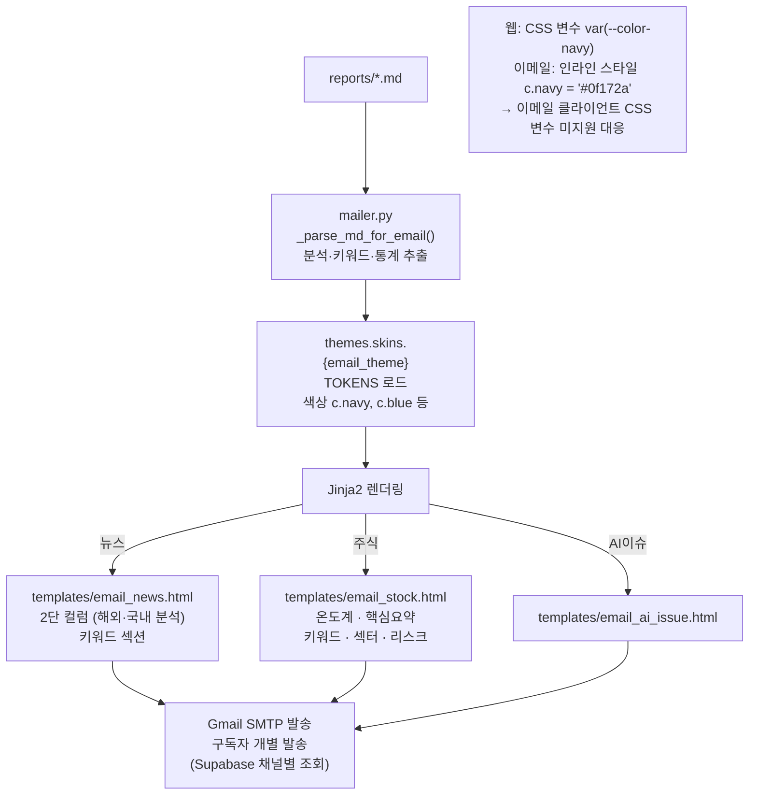
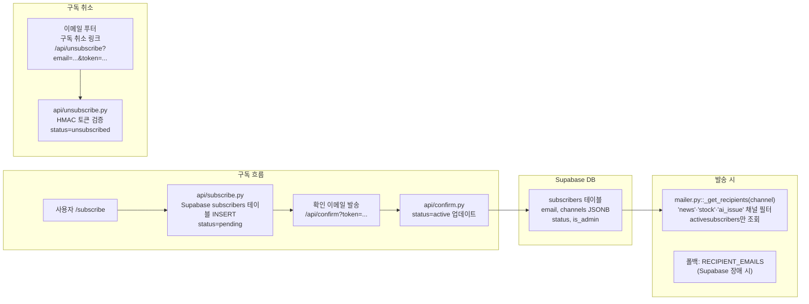
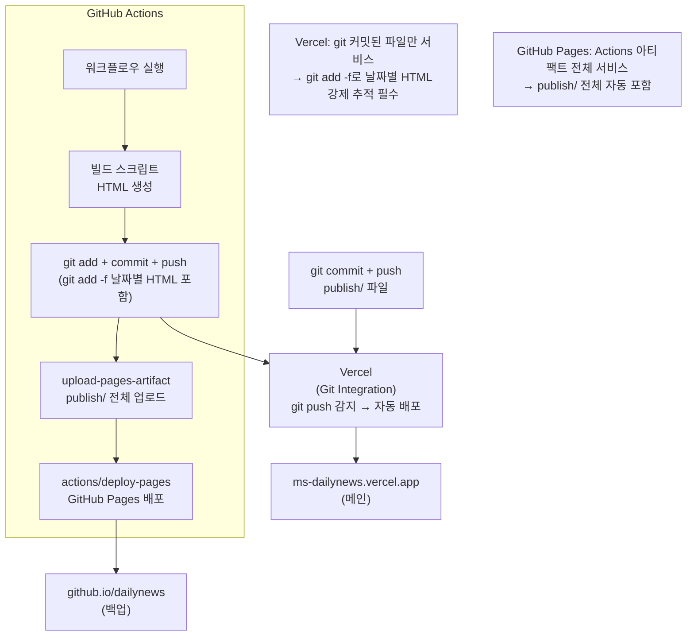
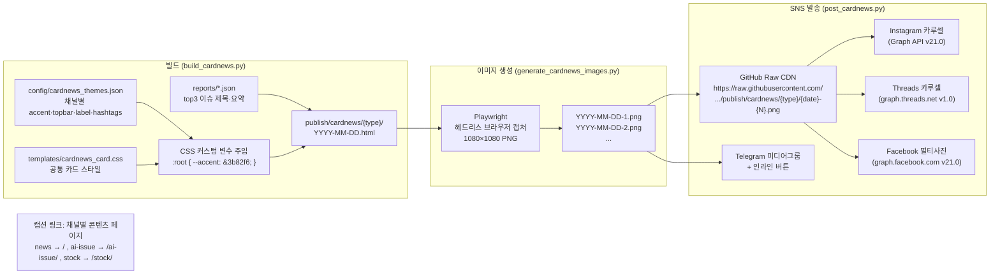
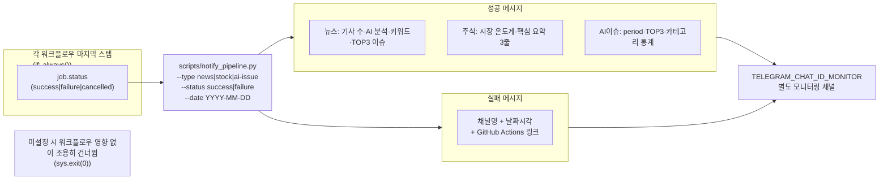

# AI News Brief — 시스템 아키텍처

> README의 L1·L2 다이어그램에서 이어지는 심화 문서입니다.

---

## 1. 핵심 설계 원칙

```
구조(Structure)   templates/*.html    HTML 골격, 레이아웃
테마(Theme)       themes/{name}.py    색상, 폰트 CSS 토큰
콘텐츠(Content)   reports/*.md        수집 데이터 + AI 분석 텍스트

→ 세 요소 완전 분리: 테마만 바꿔도 전체 디자인 변경
→ config/ 에서 중앙 제어 (하드코딩 금지)
```

---

## 2. 테마 시스템

### 2-1. 테마 종류

```mermaid
graph LR
    subgraph LAYOUTS["themes/layouts/ — 독립 HTML 생성"]
        ED["editorial.py\n신문 마스트헤드\nNoto Serif KR · 현재 기본"]
        TM["terminal.py\nBloomberg 다크\nJetBrains Mono"]
        MI["minimal.py\n넓은 여백\n오렌지 accent"]
    end

    subgraph SKINS["themes/skins/ — TOKENS 색상·폰트만 제공"]
        CL["classic.py\n남색 카드"]
        IN["ink.py\n붉은 accent"]
        FO["forest.py\n에메랄드"]
    end

    BASE["themes/base.py\nJinja2 렌더링 엔진\nweb_*.html 템플릿 사용"]

    SKINS --> BASE
    LAYOUTS -.->|render_*() 직접 생성| HTML["최종 HTML"]
    BASE --> HTML
```

### 2-2. 테마 로드 순서

```python
# themes/__init__.py::load_theme()
# 탐색 순서: layouts.{name} → skins.{name} → skins.classic(폴백)
theme = load_theme("editorial")   # layouts/editorial.py
theme = load_theme("classic")     # skins/classic.py
theme = load_theme("unknown")     # → skins/classic 폴백
```

### 2-3. 섹션별 테마 독립 설정

```python
# config/theme_config.py
SITE_THEME = "editorial"   # 전체 기본

SECTION_THEMES = {
    "news":     os.getenv("THEME_NEWS",     SITE_THEME),
    "stock":    os.getenv("THEME_STOCK",    SITE_THEME),
    "ai-issue": os.getenv("THEME_AI_ISSUE", SITE_THEME),
    "email":    os.getenv("THEME_EMAIL",    "classic"),  # 이메일은 classic 고정
}
```

---

## 3. 렌더링 경로

### 3-1. 웹 HTML 생성



### 3-2. 이메일 HTML 생성



---

## 4. 구독 시스템



---

## 5. 배포 구조



### 파일별 git add 전략

| 파일 유형 | 방법 | 이유 |
|-----------|------|------|
| `publish/news/YYYY-MM-DD.html` | `git add -f` | `.gitignore`로 추적 제외, Vercel 배포용 강제 추가 |
| `publish/app.html`, `index.html` | `git add -f` | 항상 최신 상태 유지 필요 |
| `publish/search-index.json` | `git add -f` | Vercel 검색 기능용 |
| `publish/news/data.json` | `git add -f` | app.html SPA 데이터 소스 |
| `reports/*.md` | `git add` | 소스 파일, 정상 추적 |

---

## 6. 카드뉴스 파이프라인



---

## 7. 파이프라인 모니터링



---

## 8. 설정 파일 맵

| 변경 목적 | 수정 파일 |
|----------|----------|
| 전체 테마 변경 | `config/theme_config.py` → `SITE_THEME` |
| 채널별 테마 독립 설정 | `config/theme_config.py` → `SECTION_THEMES` |
| 색상·폰트 수정 | `themes/skins/{name}.py` → `TOKENS` |
| 뉴스 이메일 레이아웃 | `templates/email_news.html` |
| 주식 이메일 레이아웃 | `templates/email_stock.html` |
| 뉴스 웹 레이아웃 (skins) | `templates/web_news.html` |
| editorial 레이아웃 | `themes/layouts/editorial.py` → `render_*()` |
| RSS 소스 추가·제거 | `config/sources/en_news.py`, `ko_news.py` |
| 주식 감시 종목 | `config/watchlist.yaml` |
| 카드뉴스 색상·해시태그 | `config/cardnews_themes.json` |
| 사이트 제목·URL | `config/theme_config.py` → `SITE_TITLE`, `SITE_BASE_URL` |
| 워크플로우 스케줄 | `.github/workflows/news.yml`, `ai_issue.yml` |
| 구독 API 라우팅 | `vercel.json` |
