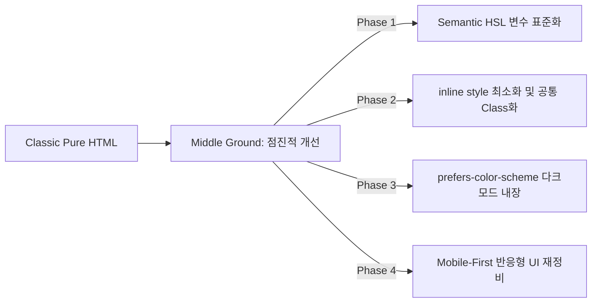

# 📋 DailyNews & Stock Briefing 프로젝트 이력 분석 및 개선 종합 보고서

> **분석 대상**: `docs/chat_history/` 내의 모든 대화 로그 및 점검 보고서  
> (`worklog.md`, `2026-05-27.md`, `ui_stack_review_2026-05-25.md`, `system_inspection_report.md`, `2026-05-24_claude.md`, `qna.md`)  
> **기준 일자**: 2026-05-29  
> **작성자**: Antigravity (AI Co-Pilot)

그간 진행되었던 대화 이력과 개발 로그를 종합적으로 검토하여, **기 완료된 성과**, **현재 미완료 상태인 과제**, **즉각적인 수정이 필요한 버그 및 시스템 개선 사항**, 그리고 **사용자 요청 사항(종목별 히스토리 관리 및 UI 스택 전환 등)에 대한 구체적인 분석과 실행 방안**을 정리한 보고서입니다.

---

## 📂 목차
1. [완료 및 기적용된 핵심 성과 (Completed Work)](#1-완료-및-기적용된-핵심-성과-completed-work)
2. [미완료 과제 및 검증 필요 항목 (Incomplete / Pending)](#2-미완료-과제-및-검증-필요-항목-incomplete--pending)
3. [즉시 수정 필요 버그 & 개선 권장사항 (Critical Bugs & Improvements)](#3-즉시-수정-필요-버그--개선-권장사항-critical-bugs--improvements)
4. [종목별 누적 히스토리 관리(reports/history/) 결함 분석 및 해결 방안](#4-종목별-누적-히스토리-관리reportshistory-결함-분석-및-해결-방안)
5. [UI 스택 현대화 로드맵 (Modern UI Stack Roadmap)](#5-ui-스택-현대화-로드맵-modern-ui-stack-roadmap)
6. [종합 우선순위 및 추천 실행 매트릭스](#6-종합-우선순위-및-추천-실행-매트릭스)

---

## 1. 완료 및 기적용된 핵심 성과 (Completed Work)

그동안 여러 차례의 이터레이션을 통해 데일리뉴스 및 주식시황 파이프라인의 완성도를 획기적으로 높였습니다. 주요 적용 완료 사항은 다음과 같이 분류됩니다.

### 💻 프론트엔드 (SPA UI/UX 및 테마)
* **`marked.js` 마크다운 파서 전격 이식**: SPA(`app.html`) 내부의 불완전한 정규식 기반 `md2html`을 폐기하고, 글로벌 표준 파서인 `marked.js`를 연동하여 마크다운 단락 구분이 무너지거나 볼드 마커(`**`)가 노출되는 오류를 완벽하게 해결했습니다.
* **뉴스 요약 카드 내 마크다운 파싱 적용 (05-27 완료)**: 주식시황 및 뉴스 요약 영역에서 줄바꿈이 무너지고 텍스트가 뭉개지던 현상을 `md2html`을 거쳐 리스트(`<li>`)와 볼드(`<strong>`) 스타일로 정상 렌더링되도록 수정했습니다.
* **디자인 테마 시스템 SPA 이식**: `editorial` (마스트헤드, 크림 배경, 붉은 포인트) 및 `terminal` (블룸버그 스타일 2-column 다크모드) 테마의 CSS 변수와 폰트 CDN을 SPA 화면 및 내비게이션 칩에 적용 완료했습니다.
* **섹션별 독립 테마 시스템 구현**: 뉴스 브리핑과 주식시황이 각각 서로 다른 테마를 적용받을 수 있도록 테마 변수(`newsTheme`, `stockTheme`)를 localStorage로 격리 제어하고, `theme_config.py`의 `SECTION_THEMES` 설정을 SPA 빌드 시점에 자동 인젝션했습니다.
* **가로 스크롤 카드뉴스 UI 활성화 (◀ / ▶ 제어 버튼 탑재)**: 모바일에만 유용하던 가로 스크롤 슬라이더에 데스크톱 사용성을 극대화하기 위해 Vanilla JS 기반의 `scrollSlider()` 제어 버튼 및 인덱스 추적 투명도 이벤트를 장착하여 공식 릴리즈했습니다.
* **`reports-data.json` 초경량화 (2.1MB → 484KB) 및 Lazy-load 적용**: 2MB가 넘어 최초 페이지 진입 시 로딩 지연을 유발하던 JSON 데이터를 날짜별 `publish/news/YYYY-MM-DD.json` 파일로 쪼개고, 사용자가 날짜 클릭 시 비동기로 필요한 데이터만 가져오도록(Lazy-fetch) 전환했습니다.

### ⚙️ 백엔드 및 수집 파이프라인
* **중복 수집 방지 알고리즘 최적화**: 매 실행마다 유실되던 Actions 환경의 `.cache`를 극복하고자, 이미 로컬 저장소에 커밋되어 영구 보존 중인 `publish/reports-data.json` 내의 3일치 수집 이력 링크를 긁어와 중복 체크용 캐시(`seen_urls`)로 동적 활용하도록 설계하여 중복 수집 문제를 원천 봉쇄했습니다.
* **템플릿 통합 리팩토링 (`templates/` 집중)**: `storage/`에 잘못 혼재해 있던 이메일 템플릿과 Python f-string 기반의 웹 렌더러를 모두 Jinja2 템플릿 형식으로 표준 통일하고 `templates/` 디렉토리로 단일 집중시켰습니다.
* **주식 백업 수집 스케줄링**: `yfinance` 기반의 백업 수집/분석 엔진(`stock_main.py`)을 평일 KST 23:40 크론으로 탑재하여, 1차 경로인 Claude 루틴이 실행되지 않더라도 Actions가 자동으로 최종 마감 브리핑을 완성하도록 이중 안전망을 갖추었습니다.

### 🚀 배포 및 CI/CD 워크플로우
* **Vercel CLI 무인 빌드-배포 우회**: 봇 푸시 시 Actions 미트리거 규칙 및 `GITHUB_TOKEN` 푸시 시 Vercel Webhook 패싱 문제를 해결하기 위해, 워크플로우 마지막 단계에 Vercel CLI 무인 배포 명령어(`npx vercel --prod --yes`)를 강제 삽입하여 두 사이트의 실시간 동기화를 달성했습니다.
* **배포 충돌 및 덮어쓰기 해결 (05-27 완료)**: 개발용 브랜치(feature)에서 빌드가 돌아 불완전한 개발용 정적 폴더가 GitHub Pages의 최신 main 빌드를 덮어쓰는 사고를 막고자, `stock_build.yml`의 push 트리거 범위를 `main` 브랜치 단독으로 한정 조치했습니다.

---

## 2. 미완료 과제 및 검증 필요 항목 (Incomplete / Pending)

기록 및 로그 파일(`worklog.md` 등) 분석 결과, 계획에는 포함되어 있으나 아직 공식적으로 실 운영 환경에서 완벽히 검증되지 않았거나 실행 보류된 태스크 목록입니다.

| 항목 | 현재 상태 | 분석 및 다음 대응 |
| :--- | :--- | :--- |
| **JSON Rich UI 실 테스트** | **미완료 / 보류** | `editorial` 및 `terminal` 테마 환경에서 LLM의 JSON 응답 모드가 정상 구동하고, 컴포넌트(카테고리 바, Top Stories 카드 등)에 제대로 바인딩되는지 1회 이상 실 배포 빌드 확인이 필요합니다. |
| **Phase 2 카드뉴스 생성 자동화** | **기획 단계 (미시행)** | JSON 사이드카 데이터를 활용하여 SNS 배포용 카드뉴스를 자동으로 파싱/내보내기(e.g., `html2canvas` 등을 이용한 이미지화) 하는 파이프라인의 실 구현이 아직 진행되지 않았습니다. |
| **GitHub Secrets 최종 확인** | **확인 필요** | 네이버 검색 및 기사 수집 API용 `NAVER_CLIENT_ID` 및 `NAVER_CLIENT_SECRET`이 GitHub Secrets에 정상 등록되어 작동하는지 검증해야 합니다. (미보유 시 백업 경로가 스킵될 수 있음) |
| **Notion API 연동 개발** | **완료 (워크플로우 순서 버그 수정됨)** | `core/shared/notion.py` 및 `scripts/sync_notion.py` 연동 레이어는 완벽히 구현되어 있습니다. 다만, `news.yml` 워크플로우에서 `sync_notion.py`가 필요로 하는 `publish/news/YYYY-MM-DD.json` 파일이 생성되기도 전에 동기화 스텝이 구동되는 **순서 결함(Sequence Bug)**이 존재하여 그간 뉴스 동기화가 자동으로 누락(Skip)되었습니다. 이 결함은 05-29에 즉각 발견 및 해결 완료되었습니다. |
| **클라우드 데이터베이스 전환** | **계획 단계 (미구현)** | Actions 무상태(Stateless) 환경의 한계를 극복하고 장기적인 데이터를 누적 관리하기 위해 Supabase 혹은 Neon DB로의 DB 레이어 이전이 중장기 백로그로 남겨져 있습니다. |

---

## 3. 즉시 수정 필요 버그 & 개선 권장사항 (Critical Bugs & Improvements)

지난 5월 24일 클로드 에이전트의 종합 진단서 및 코드 정적 분석 결과 발견된 시스템 내부 결함과 버그 정보입니다. **이 중 일부는 현재 시점(05-29)에도 여전히 수정되지 않고 레포지토리에 방치되어 있습니다.**

### 🔴 [즉시 수정 대상] `core/shared/mailer.py` 내 경로 버그로 인한 구독 취소 오작동
* **현상**: 사용자가 웹페이지에서 '구독 취소'를 눌러 Vercel 서버리스 함수가 `storage/unsubscribed.txt`를 정상 갱신해도, 매일 뉴스를 발송하는 메일러 모듈은 구독 취소 명단을 읽지 못해 **구독을 취소한 메일로도 뉴스레터가 계속 발송되는 치명적인 동작 오류**가 있습니다.
* **원인**: `core/mailer.py`를 `core/shared/mailer.py`로 옮기는 과정에서 `parent` 디렉토리 경로 계산을 3단계(`__file__.parent.parent.parent`)가 아닌 2단계로 지정하여, 존재하지도 않는 `core/storage/unsubscribed.txt`를 바라보기 때문입니다.
* **해결 코드**: `core/shared/mailer.py` 47라인을 다음과 같이 즉시 변경해야 합니다.
  ```python
  # AS-IS (잘못됨 - core/storage/... 참조)
  _UNSUB_FILE = Path(__file__).parent.parent / "storage" / "unsubscribed.txt"
  
  # TO-BE (올바름 - 루트의 storage/... 참조)
  _UNSUB_FILE = Path(__file__).parent.parent.parent / "storage" / "unsubscribed.txt"
  ```

### 🔴 [보안 및 안정성 취약점] HTTPS SSL 인증서 강제 검증 해제
* **현상**: `scripts/run_news.py` 27라인과 `scripts/stock_main.py` 32라인에 `ssl._create_default_https_context = ssl._create_unverified_context` 코드가 삽입되어 외부 SSL 인증 검사를 완전 차단하고 있습니다.
* **위험성**: GitHub Actions 공유 빌드 컨테이너 환경 내에서 HTTPS RSS 피드, API 호출, LLM 등과의 외부 원격 통신 시 **중간자 공격(MITM)**에 무방비 노출되어 보안상 극히 취약합니다.
* **개선안**: SSL 에러가 발생하는 특정 RSS 피드만 타겟하여 우회 라이브러리를 쓰거나 예외 처리를 정교화하고, 글로벌 context 차단 코드 자체는 즉각 삭제 조치해야 합니다.

### 🟠 [코드 안정성 문제] SMTP 이메일 발송 중 1명만 오류가 나도 전체 발송이 중단되는 결함
* **현상**: 수신자 리스트(`recipients`)를 순회하며 `smtp.sendmail()`을 실행할 때, 개별 루프 내에 `try-except`가 없어 **특정 수신자 1명의 주소 오타나 메일서버 거부 예외가 발생하면 루프 전체가 break 되어 그 뒤에 대기 중인 정상 구독자들에게 메일이 전혀 발송되지 않는 심각한 결함**이 존재합니다.
* **개선안**: `core/shared/mailer.py` 내의 수신자 발송 루프 내부에 개별 `try-except Exception` 예외 격리 장치를 탑재해야 합니다.

### 🟠 [중복 코드 및 설정 결함] 프롬프트 중복 및 API 텍스트 제거 한계
1. **프롬프트 100% 중복**: `config/prompts.py` 내의 `PROMPT_TEMPLATE_KO`와 `PROMPT_TEMPLATE_EN`은 텍스트 내용이 완전히 중복되어 있습니다. 단일 템플릿으로 추출하고 실행 인자로 `lang_label`만 맵핑하도록 단순화가 가능합니다.
2. **네이버 기사 HTML 필터링 부실**: `core/stock/collector.py` 111라인에서 네이버 뉴스 API 데이터 수집 시 HTML 볼드 태그(`<b>`, `</b>`)만 단순히 replace 처리하고 있습니다. 이로 인해 `&amp;`, `&quot;`, `&#039;` 등의 인코딩 깨진 특수 문자나 타 태그가 그대로 노출되는 시각적 품질 결함이 있습니다. (`re.sub`와 `html.unescape` 필터 도입 권장)

---

## 4. 종목별 누적 히스토리 관리(`reports/history/`) 결함 분석 및 해결 방안

> [!IMPORTANT]
> **사용자 제기 이슈**: "히스토리 폴더에 md 파일이 생성되지 않고 업데이트되는지 확인이 어렵다. 현재 비어 있는 것처럼 보이고 실제 작동 여부가 의심된다. 동향 및 이슈 등에 Obsidian 스타일의 종목 프로필 템플릿 주입과 누적 업데이트가 원활하게 지원되는가?"

### 🔍 원인 정밀 분석
1. **로컬 개발 환경과 Actions 배포 환경의 '동기화 괴리'**:
   * 현재 `reports/history/` 내부에는 31개의 종목 파일(e.g., `005930.KS.md`, `NVDA.md` 등)이 **실제 생성되어 누적 관리**되고 있습니다.
   * 그러나 이 업데이트 작업은 사용자가 로컬에서 Claude 코드를 직접 실행할 때가 아니라, GitHub Actions 배포 파이프라인(`stock_build.yml` 내 `python scripts/update_history.py`) 단계에서 전담하여 빌드 후 원격 Git에 자동으로 Push하고 있습니다.
   * 이로 인해 사용자가 **로컬 작업공간에서 `git pull`을 제때 수행하지 않았거나**, Actions가 봇 자동 커밋 제약 등으로 인해 푸시 도중 누락/블락을 당했다면 로컬에서는 해당 폴더가 비어 있거나 업데이트가 지연되는 것처럼 오인할 여지가 매우 큽니다.
2. **반쪽짜리 수집 범위 (yfinance 가격 수집의 한계)**:
   * 현재 `update_history.py` 엔진은 오직 `config/watchlist.py`에 등록된 고정 종목 리스트만을 타겟으로 `yfinance`를 활용해 **당일 종가와 변동률(%) 테이블 데이터**만 누적 기록하고 있습니다.
   * 즉, 사용자가 진정 원했던 **"오늘자 데일리 브리핑에서 AI가 강조 언급한 특정 종목들에 관한 동향/핵심 이슈의 누적 업데이트"**는 자동화 엔진이 지원하지 못하고, 오직 루틴이 MD 파일 내 `<!-- ISSUES_TOP -->` 마커에 직접 수동으로 동향을 추가해야만 하는 설계적 공백 상태입니다.

### 🛠️ 극복을 위한 4단계 해결 방안
* **1단계: 로컬 풀(Pull) 습관화 및 푸시 트리거 확인**: 로컬에서 수시로 `git pull`을 수행하여 Actions가 원격에서 성실히 기록/커밋한 종목 히스토리 파일들을 확인합니다.
* **2단계: '언급된 종목 동향' 자동 파싱 시스템 구축**:
  * 당일 주식 브리핑 원본 마크다운(`reports/stock/stock_YYYY-MM-DD.md`) 내의 **"주요 종목 분석"** 혹은 **"섹터별 흐름"** 섹션을 정규식으로 파싱합니다.
  * 해당 일에 구체적으로 어떤 이슈와 강점/약점이 언급되었는지 추출하여 `reports/history/종목명.md` 파일의 `<!-- ISSUES_TOP -->` 하단에 날짜 헤더와 함께 요약 텍스트를 자동으로 append 해 주는 분석 플러그인을 `update_history.py`에 이식합니다.
* **3단계: 완벽한 Obsidian 템플릿 강제 주입**:
  * 사용자가 제공한 YAML frontmatter 프레임 및 GICS 분류, 투자 포인트, 연관 기업 관계망, 재무 정보 테이블, 관련 네이버/야후/SEC 링크, 연결 노트(`[[테마명]]`) 포맷을 가진 **고품격 `templates/stock_history.md` 파일**이 온전히 보존되어 있습니다.
  * 신규 티커 감지 시 반드시 이 템플릿 양식으로 최초 파일이 초기 생성되도록 보장하고, 기존 이력 파일의 누락 필드가 자동 보완되도록 마이그레이터 기능을 강화합니다.

---

## 5. UI/UX 스택 현대화 로드맵 (Modern UI Stack Roadmap)

`ui_stack_review_2026-05-25.md` 분석 결과, 현재 UI 구조는 Pure Vanilla JS + CSS 변수 주입 방식의 정적 페이지 묶음입니다. 이를 React/Next.js + Tailwind + shadcn/ui 표준 지침으로 완전 전향하려면 프론트엔드 전체를 새로 짜야 하는 큰 공수가 들어갑니다 (1인 개발 기준 약 2~3주 소요).

이에 따라, 1인 운영 자동화 프로젝트라는 본질에 부합하는 **현실적인 점진적 현대화 방안 (Middle Ground)**을 수립하여 추천합니다.



### 🎯 핵심 징검다리 액션 플랜 (현 구조를 깨지 않고 모던 지침 수용하기)
1. **CSS Variables 명명 체계 및 포맷 표준화**:
   * 현 `--bg`, `--text`, `--blue` 형태의 Hex 변수군을 지침 요구 사항인 `--background`, `--foreground`, `--primary` 등의 HSL 포맷 변수로 순차 리팩토링합니다.
   * `themes/base.py` 및 테마 파일들에서 이를 일관되게 주입하도록 헬퍼 함수를 미세 튜닝합니다.
2. **인라인 스타일(Inline Style) 척결**:
   * `app.html` 및 개별 웹페이지 템플릿에 직접 하드코딩된 약 30여 개의 `style="..."` 속성들을 클래스 선택자 형태로 정의하고 별도의 `index.css` 혹은 공통 스타일 시트로 밀어내어 소스 가독성을 극대화합니다.
3. **다크모드 지원**:
   * SPA 브라우저 단에서 사용자의 OS 테마(`@media (prefers-color-scheme: dark)`) 또는 칩 선택에 따라 클래스 제어 기반으로 다크모드 변수군(`.dark { --background: ... }`)이 자연스럽게 매핑되도록 이식합니다.
4. **매직 넘버(Magic Number) 제거**:
   * UI 여백이나 박스 크기에 하드코딩되어 박혀 있던 `height: 58px`, `padding: 28px 32px` 같은 매직 수치들을 지침대로 `--radius-card`, `--spacing-md` 등의 공통 토큰화하여 유연하고 확장성 높은 구조로 바꿉니다.

---

## 6. 종합 우선순위 및 추천 실행 매트릭스

현재 산적한 미완료 태스크, 버그, 개선 요청 사항들을 시급성과 중요도를 기준으로 행렬 재배치하여 즉시 실행 가능한 마일스톤으로 제안합니다.

```
                  ▲ [높음]
                  │
                  │  ⭐ [우선순위 1]
                  │  - mailer.py 경로 버그 해결 (BUG-01)
                  │  - stock_history obsidian 템플릿 마크업 누적 구현
                  │
  중              │  ⭐ [우선순위 2]
  요              │  - SMTP 메일 루프 예외 격리 (ISSUE-04)
  도              │  - SSL unverified context 강제 제거 및 특정 RSS 디버그 (BUG-02)
                  │  - 네이버 검색 API HTML 특수문자 파싱 정화 (ISSUE-06)
                  │
                  │  ⭐ [우선순위 3]
                  │  - UI HSL 변수 명명 표준화 & 인라인 CSS 걷어내기
                  │                  │  - Notion 연동 순서 결함 최종 검증
                  │  - JSON Rich UI 실 서버 연계 테스트
                  │
                  └────────────────────────────────────────────────────────►
                                          시급성 / 난이도 [낮음 → 높음]
```

### 🗓️ 권장 액션 가이드라인
* **즉시 실행 (마일스톤 A)**:
  1. `core/shared/mailer.py` 내의 `_UNSUB_FILE` 경로 수정 (`.parent` 3개로 복구)
  2. `core/shared/mailer.py` 내의 개별 메일 발송 루프에 `try-except` 적용하여 개별 주소 오류로 인한 전체 전송 중단 방어막 구축
  3. **[완료]** Notion 뉴스 동기화 순서 결함 수정 (`news.yml` 스텝 재정렬)
* **단기 실행 (마일스톤 B)**:
  1. `update_history.py`에 당일 AI 주식 리포트 MD 파일을 읽어와 언급된 종목에 관한 이슈 텍스트를 `<!-- ISSUES_TOP -->` 위에 cumulative append 해주는 연동 파이프라인 개발
  2. 로컬 작업공간에서 `git pull` 시 `reports/history/`에 이미 잘 적재되고 있는 31개 종목 파일들의 변화가 추적되는지 사용자와 확인 및 설명 제공
  3. `core/stock/collector.py` 내의 네이버 뉴스 HTML 이스케이프 정화 유틸 추가 및 `settings.py`의 모델 상수 명칭 간소화
* **중기 실행 (마일스톤 C - UI 고도화)**:
  1. UI의 HSL 토큰 체계 적용 및 inline style의 CSS 이주를 통해 프로젝트 전체적인 디자인 결벽성 확보
