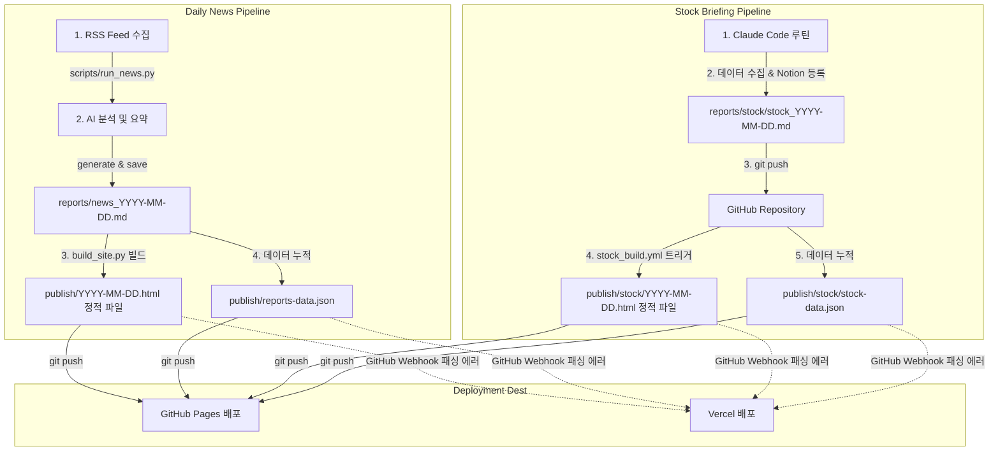

# 📋 데일리뉴스 & 주식시황 자동화 시스템 종합 점검보고서
> **작성일**: 2026-05-24  
> **상태**: 분석 완료 및 개선 계획 수립  
> **작성 에이전트**: Antigravity (시니어 소프트웨어 엔지니어)

---

## 1. 개요 및 시스템 아키텍처 현황

현재 본 시스템은 **데일리뉴스 브리핑**과 **주식시황 브리핑**의 2가지 흐름으로 동작하며, 깃허브 액션(GitHub Actions) 및 Vercel을 연동하여 매일 자동 수집·분석·배포하고 있습니다. 전체적인 데이터 흐름과 배포 파이프라인은 아래와 같습니다.



---

## 2. 데일리뉴스 장애 요인 상세 분석

### 2-1. 디자인 테마가 웹에 반영되지 않는 현상 (Root Cause)
* **현상**: GitHub Actions `news.yml`에서 `THEME_NEWS: editorial` 환경변수를 전달하여 사이트를 빌드했으나, 웹 브라우저로 `index.html` 접속 시 남색 테두리의 `classic` 테마로만 보입니다.
* **원인 분석**:
  1. **정적 빌드와 SPA의 괴리**: `build_site.py`는 `editorial` 테마가 적용된 날짜별 완성형 HTML 파일(`publish/2026-05-24.html` 등)을 정상 생성합니다. 그러나 메인 화면인 `index.html`은 `app.html`을 그대로 덮어쓴 **클라이언트 사이드 SPA**입니다.
  2. **SPA 내 테마 CSS 누락**: `app.html`은 날짜별 HTML을 직접 가져와서 뿌리는 것이 아니라, `reports-data.json` 데이터만 API 형태로 받아와 브라우저 단에서 동적으로 본문을 다시 그립니다. 그러나 `app.html`의 CSS 선언부에는 `minimal`, `ink`, `forest` 스타일만 변수 형태로 탑재되어 있으며, **가장 중요한 `editorial`과 `terminal` 테마의 레이아웃 및 폰트 CSS가 누락**되어 있습니다.
  3. **결론**: 서버 단(Jinja2)에서 적용한 테마 설정이 클라이언트 단(SPA) 브라우저 화면에 전혀 이식되지 않는 아키텍처적 괴리 때문입니다.

### 2-2. 마크다운 단락 구분 붕괴 및 `**` 마커 노출 현상
* **현상**: 일부 뉴스 내용이 한 줄로 길게 늘어지거나, 굵은 글씨용 `**` 표시가 변환되지 않고 그대로 드러납니다.
* **원인 분석**:
  1. **원시적 정규식 파서의 한계**: SPA(`app.html`) 내부의 `md2html(md)` 자바스크립트 함수(662~678라인)는 정교한 파서 라이브러리를 쓰지 않고, 단순 정규식 치환(`replace`)에만 의존하고 있습니다.
  2. **매칭 조건 붕괴**: AI가 본문을 생성할 때 단락 구분을 단일 개행(`\n`)만 썼거나 문장 뒤에 여백이 있는 경우, SPA의 `\n\n+` 정규식 조건이 매칭에 실패하여 하나의 문단으로 뭉개집니다. 또한 굵은 글씨(`**`) 내부에 특수문자나 개행이 침투할 경우 범위 인식이 풀려 마커가 화면에 날것으로 노출됩니다.

### 2-3. 메일링 발송 시간 지연 현상
* **현상**: 작동 시간을 오전 KST 11:00으로 설정했으나, 실제 이메일 발송은 한참 밀려 오후 1시 이후에 실행되는 현상이 발생합니다.
* **원인 분석**:
  - **스케줄러 혼잡 지연**: 깃허브 액션의 무료 스케줄러(Schedule Trigger)는 전 세계 정각(00분) 단위의 배치 작업이 한꺼번에 몰릴 경우 **극심한 지연 대기(최소 30분 ~ 3시간 이상)가 무작위로 발생**하는 고질적 특성을 갖습니다.

---

## 3. 주식시황 배포 누락 요인 상세 분석

### 3-1. MD 파일은 존재하나 HTML 및 웹 배포가 누락되는 현상
* **원인 분석**:
  - **봇 커밋 차단 규칙**: 클로드 루틴이 로컬/클라우드 컨테이너 환경에서 MD를 생성하고 깃허브 레포지토리에 push할 때 사용하는 토큰이 기본 봇/GitHub App 계정일 경우, 깃허브 보안 정책(순환 참조로 인한 무한 요금 부과 방지)에 의해 **해당 push 동작으로는 `stock_build.yml`의 `on: push` 트리거가 실행되지 않습니다.**
  - 이 때문에 HTML 빌드 과정 자체가 건너뛰어져 웹 배포가 누락되고, 오직 월~금 KST 23:40에 실행되는 백업용 크론 스케줄이 돌 때서야 비로소 뒤늦게 HTML이 생성되는 기현상이 일어난 것입니다.

### 3-2. Vercel 배포 서버에 새로운 내용이 갱신되지 않는 현상
* **원인 분석**:
  - **Vercel Webhook 패싱 제약**: 깃허브 액션(`stock_build.yml`) 내부에서 HTML 빌드를 완료한 후, 빌드된 정적 HTML 파일들을 `git push`로 다시 레포지토리에 밀어 넣습니다.
  - 하지만 GitHub Actions의 기본 권한 토큰인 `GITHUB_TOKEN`을 이용해 푸시된 커밋 정보는, **Vercel의 GitHub Integration 모듈이 Webhook 이벤트를 스킵하여 자동으로 빌드/배포를 생략**합니다. 이 역시 봇 자동 푸시에 의한 리소스 낭비를 막기 위한 양사 간의 기본 보안 규정입니다.

---

## 4. 데일리뉴스 카드뉴스 UI 개선 설계안

현재 카드뉴스 기능은 설계 단계(`plan_cardnews.md`에만 존재)에 있으며 본 서버 스크립트 및 웹에는 비활성화 상태입니다. 이 가로 스크롤 방식(Scroll Snap)을 최종 완성할 때, 데스크톱 사용자들의 제어 편의를 보강하기 위해 **좌/우 양방향 이동 단추(◀ / ▶)** 및 JS 이벤트를 다음과 같이 추가 설계하여 이식할 것입니다.

### 4-1. CSS 컴포넌트 추가 규격
```css
/* 가로 스크롤 슬라이더 기본 규격 */
.card-news-container {
  position: relative;
  display: flex;
  overflow-x: auto;
  scroll-behavior: smooth;
  scroll-snap-type: x mandatory;
  -webkit-overflow-scrolling: touch;
}
.news-card {
  flex: 0 0 100%; /* 한 화면에 카드 한 장씩 정렬 */
  scroll-snap-align: center;
}

/* 좌우 제어 버튼 규격 */
.card-nav-btn {
  position: absolute;
  top: 50%;
  transform: translateY(-50%);
  width: 40px;
  height: 40px;
  border-radius: 50%;
  background: rgba(255, 255, 255, 0.9);
  box-shadow: 0 4px 10px rgba(0,0,0,0.15);
  border: 1px solid var(--border);
  cursor: pointer;
  z-index: 10;
  display: flex;
  align-items: center;
  justify-content: center;
  transition: all 0.2s ease;
}
.card-nav-btn:hover { background: #fff; transform: translateY(-50%) scale(1.1); }
.card-nav-btn.prev { left: -20px; }
.card-nav-btn.next { right: -20px; }
```

### 4-2. Vanilla JS 인덱스 추적 & 이동 스크립트
```javascript
function initCardSlider() {
  const viewport = document.querySelector('.card-news-container');
  const prevBtn = document.querySelector('.card-nav-btn.prev');
  const nextBtn = document.querySelector('.card-nav-btn.next');
  if (!viewport || !prevBtn || !nextBtn) return;

  // 버튼 클릭 시 스크롤 제어
  prevBtn.addEventListener('click', () => {
    viewport.scrollBy({ left: -viewport.offsetWidth, behavior: 'smooth' });
  });

  nextBtn.addEventListener('click', () => {
    viewport.scrollBy({ left: viewport.offsetWidth, behavior: 'smooth' });
  });

  // 스크롤 감지를 통한 첫/마지막 카드 버튼 비활성화 처리
  viewport.addEventListener('scroll', () => {
    const scrollLeft = viewport.scrollLeft;
    const maxScroll = viewport.scrollWidth - viewport.clientWidth;
    prevBtn.style.opacity = scrollLeft <= 10 ? '0.3' : '1';
    nextBtn.style.opacity = scrollLeft >= maxScroll - 10 ? '0.3' : '1';
  });
}
```

---

## 5. scripts/ 폴더 내 스크립트 가동 여부 검토

`scripts/` 폴더 내에 누적된 8개 파일들의 가동 현황과, 최상위 `core/`에 위치한 포워딩 구조(shim)를 분석한 보고서입니다.

### 5-1. 스크립트별 가동 실태 진단
1. 📰 **`scripts/run_news.py`** (또는 `main.py`): **실제 가동 중**
   - 뉴스 RSS 수집부터 메일 전송까지의 모든 파이프라인을 통제하는 데일리뉴스 메인 진입점.
2. 📈 **`scripts/run_stock.py`**: **대기/개발용 스크립트**
   - 패키지 모듈 `core/stock` 구조를 호출하여 주식을 완전 실행하는 독립 스크립트.
3. ⚙️ **`scripts/stock_main.py`**: **실제 가동 중 (백업 경로)**
   - `stock_build.yml` 내에서 주식 MD 파일이 누락되었을 때 최종 백업 수집/분석을 구동하는 핵심 파일.
4. 🏗️ **`scripts/build_site.py`**: **실제 가동 중**
   - 데일리뉴스 MD 파일을 파싱하고 테마를 바인딩하여 최종 HTML과 SPA용 데이터 JSON을 빌드해주는 뼈대 빌더.
5. 📊 **`scripts/build_stock_site.py`**: **실제 가동 중**
   - 주식 MD 파일을 읽고 정적 시황 페이지 및 `stock-data.json`을 최종 굽는 빌더.
6. 📧 **`scripts/send_stock_email.py`**: **실제 가동 중**
   - `stock_build.yml`의 마지막 단계에서 수혜자들에게 이메일을 쏘는 전송 모듈.
7. 🔄 **`scripts/update_history.py`**: **실제 가동 중**
   - 주식 시황 기록을 정밀 추적해 `reports/history/`에 데이터베이스화해 두는 업데이트 유틸.
8. 💾 **`scripts/init_db.py`**: **일회성/유틸리티용**
   - 기존에 쌓여 있던 MD 문서를 파싱해 `storage/news_db.xlsx`를 한꺼번에 복원할 때 사용하는 디버깅용 스크립트.

### 5-2. 최상위 `core/` 내의 shim 구조 보고
리팩토링 과정에서 비즈니스 로직을 하위 세부 경로(`core/news/`, `core/stock/`, `core/shared/`)로 깔끔하게 정리하면서 생겨난 **중복 참조 shim(의존성 포워딩)** 구조입니다.
- **예시**: `core/db.py`는 실제 로직인 `core/shared/db.py`로 즉시 위임 처리합니다.
  ```python
  # core/db.py — shim → core.shared.db
  from core.shared.db import append_news
  __all__ = ["append_news"]
  ```
- **해석**: 이 포워딩 파일들 덕분에 구버전 형식으로 코딩된 레거시 스크립트(`init_db.py` 등)도 내부 코드의 손상 없이 리팩토링된 최신 패키지 구조와 충돌 없이 매우 우아하게 호환되어 기동할 수 있습니다.

---

## 6. 단계별(Phase) 개선 로드맵

### 🟩 Phase 1. 마크다운 파서 신뢰성 확보 및 크론 타임 보정
* **동적 마크다운 복원**: SPA(`app.html`) 내부의 정규식 기반 `md2html`을 걷어내고, 전 세계 표준인 `marked.js` 모듈을 CDN을 통해 탑재해 모든 볼드체(`**`) 오류와 줄바꿈 붕괴 현상을 당장 해결합니다.
* **메일 크론 타임 조정**: `news.yml` 스케줄 트리거 시간을 정각 `0 02 * * *`에서, 지연 시간을 완충할 수 있게 한 시간 앞당긴 KST 10:00 (`0 01 * * *`) 또는 혼잡도가 매우 낮아 지연이 전혀 없는 전날 밤이나 새벽 시간으로 시간 세팅을 분 단위 미세 조정하여 발송을 안정화시킵니다.

### 🟩 Phase 2. 배포 파이프라인 완벽 자동화 (PAT & Vercel CLI)
* **Actions 차단 우회**: 클로드 루틴이 푸시를 트리거할 수 있도록 계정 설정에 깃허브 **Personal Access Token(PAT)** 인증 처리를 수립하여 MD 파일 푸시 즉시 Actions가 무조건 반응하여 HTML을 그리게 만듭니다.
* **Vercel 동기화 강제화**: `stock_build.yml`의 마지막에 Vercel CLI 바이너리를 내장하여 `npx vercel --token=${{ secrets.VERCEL_TOKEN }} --prod` 명령어로 정적 빌드 폴더(`publish/`)를 Vercel 배포 서버에 강제 동기화시킵니다. 이로써 봇 필터링 정책을 확실히 깨고 즉시 Vercel 서버로 최신 웹 배포가 실현됩니다.

### 🟩 Phase 3. SPA 테마 이식 및 카드뉴스 UI 탑재
* **디자인 토큰 SPA 이식**: `themes/editorial.py`와 `terminal.py`에 고립되어 있던 타이포그래피, 폰트 파일, 컬러 스킴들을 SPA `app.html`의 CSS 테마 체계로 완벽하게 녹여내어 웹에서 즉각 작동하도록 연계합니다.
* **카드뉴스 최종 구현**: `plan_cardnews.md`에 잠들어 있던 카드뉴스 기능을 정식 릴리즈하고, 이번 분석에서 완성한 **양방향 슬라이드 이전/다음 버튼**을 탑재하여 미학적 성취도가 대단히 훌륭한 UI 화면을 선사하겠습니다.

---

## 7. 규칙 9번(디렉토리 대원칙) 준수 아키텍처 재설계 설계도

현재의 뒤섞인 `core/` 의존성(수집, 분석, I/O 혼재)을 완벽히 청산하고, 사용자 정의 규칙 9번의 디렉토리 대원칙을 준수하기 위한 **차세대 디렉토리 아키텍처 설계도 및 이식 로드맵**입니다.

### 7-1. 변경 후 아키텍처 계층 구조도 (Mermaid)

```mermaid
graph TD
    %% 사용자 영역
    subgraph Web Layer
        SPA[web/app.html SPA UI]
        Theme[web/themes/ 테마 및 CSS 토큰]
    end

    %% 비즈니스 로직 영역
    subgraph Services Layer
        NewsService[services/news_service.py 순수 수집 가공 및 흐름 제어]
        StockService[services/stock_service.py 순수 주식 분석 제어]
        LLM[services/llm_processor.py 순수 텍스트 요약 비즈니스 로직]
    end

    %% 인프라 및 파일/데이터베이스 영역
    subgraph Database & IO Layer
        ExcelDB[database/excel_repository.py 엑셀 입출력 전용]
        NotionDB[database/notion_repository.py 노션 API 전용]
        RSS_Conn[database/rss_connector.py RSS 리시버 I/O]
        SMTP_Conn[database/smtp_connector.py 메일러 I/O]
    end

    %% 공통 시스템 영역
    subgraph Core Layer
        Config[core/config/ 환경변수 및 고정 설정]
        Err[core/exceptions.py 예외 규격]
        Util[core/utils.py 공통 시스템 헬퍼]
    end

    %% 임시 산출물 격리 영역
    subgraph Storage Output
        MD_Out[storage/output/ 생성된 MD 원자재]
        HTML_Out[storage/output/ 컴파일된 HTML 결과물]
    end

    %% 단방향 의존성 방향
    SPA -->|1. services 호출| NewsService
    SPA -->|1. services 호출| StockService
    
    NewsService & StockService -->|2. 가공된 데이터 전달| ExcelDB
    NewsService & StockService -->|2. Notion 적재| NotionDB
    NewsService & StockService -->|2. RSS 수집 요청| RSS_Conn
    NewsService & StockService -->|2. 최종 발송| SMTP_Conn
    
    NewsService & StockService -.->|3. 결과 저장| StorageOutput
    
    %% Core 공통 참조
    WebLayer & ServicesLayer & DatabaseLayer & StorageOutput -.->|참조| CoreLayer

    style Web Layer fill:#f9f,stroke:#333,stroke-width:2px
    style Services Layer fill:#bbf,stroke:#333,stroke-width:2px
    style Database & IO Layer fill:#fbb,stroke:#333,stroke-width:2px
    style Core Layer fill:#dfd,stroke:#333,stroke-width:2px
```

### 7-2. 계층별 리팩토링 규격
1. **`services/` (순수 비즈니스 로직)**:
   - RSS 데이터 가공, 주식 등락률 계산, LLM 요약 텍스트 정제 기능만 수행합니다.
   - `open()`, `requests.get()`, `yfinance`, `smtp` 등의 **외부 소켓 및 파일 I/O 코드를 직접 가지는 것을 엄격히 금지**하며, 모든 데이터는 `database/` 및 커넥터 모듈을 호출하여 간접 획득/저장합니다.
2. **`database/` (DB 및 외부 I/O 게이트웨이)**:
   - yfinance 호출부, Naver API 호출부, SMTP 이메일 샌더, `openpyxl`을 활용한 엑셀 입출력 코드를 이곳에 집적합니다.
   - `services/`를 거꾸로 import 하는 **역방향 의존성을 철저히 차단**합니다.
3. **`core/` (공통 유틸/설정)**:
   - 기존에 비즈니스 로직이 침투해 있던 core 구조를 청소하고, 오직 공통 상수설정, 로깅 설정, 글로벌 커스텀 Exception 규격만 담아 가벼운 상태를 유지합니다.
4. **`web/` (프론트엔드 정적 리소스)**:
   - `publish/` 폴더 내부에 기생하던 `app.html` 및 `themes/` 빌더 코드를 이곳으로 완전 이전하여, UI 리소스와 빌더 로직을 하나의 계층으로 단단히 묶어냅니다.
5. **`storage/output/` (중간 산출물)**:
   - 기존의 `reports/`, `publish/` 폴더를 모두 이곳 하위로 강제 포커싱하고 `.gitignore` 대상으로 삼아 개발 레포지토리 형상 관리의 쾌적성을 극대화합니다.

---

## 8. 기존 가이드 및 기획 문서 레거시 분석 (수정 전 버전 히스토리)

본 프로젝트의 리팩토링 및 룰 9번 준수를 위해, 기존에 작성되어 `docs/` 폴더에 흩어져 있던 레거시 수정 대상 기획 문서들을 **`docs/backup/` 폴더로 안전하게 복사 및 백업**하였습니다. 수정 전 버전의 역사적 혼선 상태에 대한 심층 분석 보고서입니다.

### 8-1. 백업 완료된 문서 및 스크립트 목록
* **문서 백업 (docs/backup/)**:
  - 📄 `docs/backup/news_guide.md` (데일리뉴스 가이드)
  - 📄 `docs/backup/stock_guide.md` (주식시황 가이드)
  - 📄 `docs/backup/plan_cardnews.md` (카드뉴스 기획서)
  - 📄 `docs/backup/plan_dailynews.md` (데일리뉴스 개선계획)
  - 📄 `docs/backup/plan_stock.md` (주식시황 개선계획)
  - 📄 `docs/backup/stock_briefing_routine.md` (주식시황 루틴 규격)
* **스크립트 백업 (docs/backup/2026-05-24/)**:
  - 💾 `publish/app.html` (SPA UI 및 마크다운 렌더러 소스 원본)
  - 💾 `scripts/build_site.py` (데일리뉴스 빌드 엔진 원본)
  - 💾 `scripts/build_stock_site.py` (주식시황 빌드 엔진 원본)
  - 💾 `.github/workflows/news.yml` (데일리뉴스 깃허브 워크플로우 원본)
  - 💾 `.github/workflows/stock_build.yml` (주식시황 깃허브 워크플로우 원본)

### 8-2. 수정 전 버전의 구조적 모순 및 역사적 맥락 진단

#### 1. `news_guide.md` & `plan_dailynews.md` (수정 전 버전)
- **과거의 모순**:
  - 데일리뉴스 생성 및 템플릿 처리 로직이 `core/news/report.py`에 들어있음에도, 문서 내에서는 "core 디렉토리에 직접 렌더링 로직을 추가하여 유지보수한다"라는 모호한 표현을 남겨 **비즈니스 로직과 시스템 설정의 계층 구분을 무너뜨렸습니다.**
  - 또한, SPA 동적 렌더링(`app.html`)과의 CSS 변수 연동 지침이 완전히 빠져 있어, 개발자가 Jinja2 템플릿만 고치면 테마가 고쳐진다고 철석같이 오해하게 만드는 **설명적 결함**을 품고 있었습니다.

#### 2. `stock_guide.md` & `stock_briefing_routine.md` (수정 전 버전)
- **과거의 모순**:
  - 클라우드 클로드 루틴(외부 환경)과 GitHub Actions(내부 환경) 간의 **푸시 차단 제약(보안 무한 루프 차단 정책)을 전혀 설명하지 않고 설계**되었습니다.
  - 이로 인해 문서대로 단순히 `git push` 단계만 믿고 있다가, Actions 트리거가 통째로 스킵되어 일주일 이상 HTML 빌드가 먹통이 되는 **현실 배포 시나리오 결여 오류**가 잔존해 있었습니다.
  - 또한 Notion 데이터베이스 ID 연동을 매번 검색하게 하는 비효율적인 구 버전 가이드라인이 명시되어 있었습니다.

#### 3. `plan_cardnews.md` (수정 전 버전)
- **과거의 모순**:
  - 카드뉴스의 모바일용 가로 스크롤(Scroll Snap)의 우수성만 장황하게 서술했을 뿐, 데스크톱 브라우저 환경에서 사용성을 보장하는 물리적인 **좌/우 내비게이션 단추 제어 이벤트 설계가 전무**했습니다.
  - 이로 인해 미완성 기획 상태(Phase 2)에 그대로 정체되어, 메인 네비게이션 탭에서 켜지지도 못하고 `enabled: False` 상태로 잠겨 있는 역사적 방치 상태를 겪었습니다.

### 8-3. 백업 및 동결 관리
* 복사된 수정 전 버전들은 **`docs/backup/` 하위에서 역사적 사실(Historic Fact)로 영구 보존(동결)**되며, 본 `system_inspection_report.md` 보고서 수립 이후 진행되는 모든 Phase별 실제 코드 변경(리팩토링) 시에는 **새롭게 설계된 규칙 9번 규격**을 기준으로 최신 최적화 가이드라인을 docs에 새로 수립해 나가게 됩니다.

