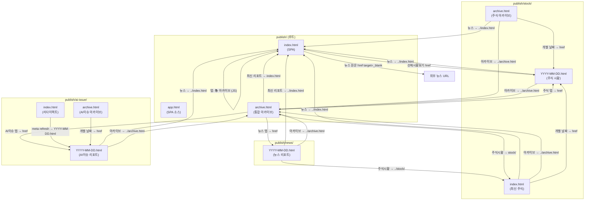
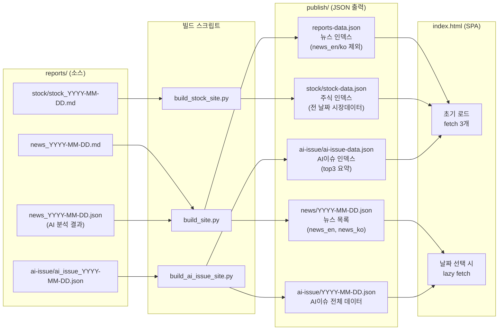
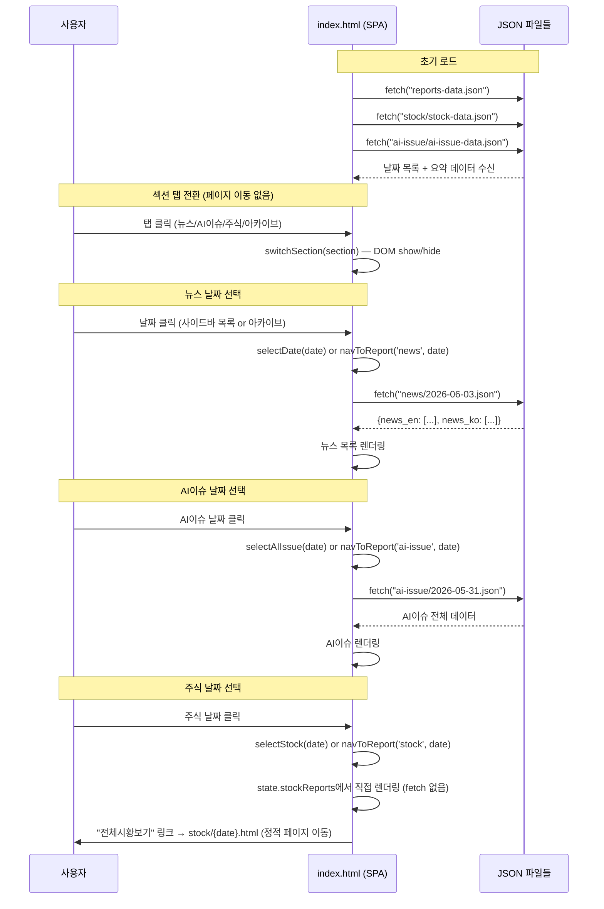

# 페이지 링크 구조 맵

> 생성: 2026-06-03  
> 대상 디렉토리: `publish/`

---

## 1. 파일 구조 한눈에 보기

```
publish/
├── index.html              ← SPA (app.html 복사 + 테마 주입)
├── app.html                ← SPA 소스 템플릿
├── archive.html            ← 통합 아카이브 (뉴스/주식/AI이슈 탭)
├── reports-data.json       ← 뉴스 인덱스 (날짜+메타, news_en/ko 제외)
├── reports.json            ← 뉴스 메타데이터 (fallback)
│
├── news/
│   ├── YYYY-MM-DD.html     ← 개별 뉴스 리포트 (정적 HTML)
│   └── YYYY-MM-DD.json     ← 뉴스 목록 (news_en, news_ko) — SPA lazy-load용
│
├── stock/
│   ├── index.html          ← 최신 주식 시황 (정적 HTML)
│   ├── archive.html        ← 주식 시황 목록 (정적 HTML)
│   ├── YYYY-MM-DD.html     ← 개별 주식 시황 (정적 HTML)
│   └── stock-data.json     ← 주식 인덱스 (전 날짜 시장 데이터)
│
└── ai-issue/
    ├── index.html          ← 최신 AI이슈로 리다이렉트 (meta refresh)
    ├── archive.html        ← AI이슈 목록 (정적 HTML)
    ├── YYYY-MM-DD.html     ← 개별 AI이슈 리포트 (정적 HTML)
    ├── YYYY-MM-DD.json     ← 개별 AI이슈 데이터 — SPA lazy-load용
    └── ai-issue-data.json  ← AI이슈 인덱스 (전 날짜 top3 요약)
```

---

## 2. 페이지 간 내비게이션 링크 관계 (Mermaid)



---

## 3. 상단 메뉴 탭 — 페이지별 href 비교

| 페이지 위치 | 최신 리포트 | 주식시황 | 아카이브 |
|---|---|---|---|
| `publish/index.html` (SPA 탭) | JS: `switchSection('news')` | JS: `switchSection('stock')` | JS: `switchSection('archive')` |
| `publish/archive.html` | `index.html` | `stock/` | `archive.html` (현재) |
| `publish/news/YYYY.html` | `../index.html` | `../stock/` | `../archive.html` |
| `publish/stock/index.html` | `../index.html` | `../stock/index.html` (현재) | `../archive.html` |
| `publish/stock/archive.html` | `../index.html` | `../stock/index.html` | `../archive.html` (현재) |
| `publish/stock/YYYY.html` | `../index.html` | `../stock/index.html` | `../archive.html` |
| `publish/ai-issue/YYYY.html` | `../index.html` | `../stock/` | `../archive.html` |

> **규칙**: `publish/` 루트 페이지 → 상대경로 그대로. 하위 디렉토리 페이지 → `../` prefix 추가.

---

## 4. JSON 데이터 흐름 (Mermaid)



---

## 5. SPA (index.html) JSON 로딩 순서

| 단계 | 트리거 | fetch 대상 | 목적 |
|---|---|---|---|
| 1 | 페이지 로드 | `reports-data.json` | 뉴스 날짜 목록·메타데이터 전체 |
| 2 | 페이지 로드 | `stock/stock-data.json` | 주식 날짜 목록·시장 지표 전체 |
| 3 | 페이지 로드 | `ai-issue/ai-issue-data.json` | AI이슈 날짜 목록·top3 요약 전체 |
| 4 | 뉴스 날짜 클릭 | `news/{date}.json` | 해당 날짜 뉴스 원문 목록 (lazy) |
| 5 | AI이슈 날짜 클릭 | `ai-issue/{date}.json` | 해당 날짜 AI이슈 전체 데이터 (lazy) |
| — | 주식 날짜 클릭 | *(fetch 없음)* | stock-data.json에서 직접 렌더링 |

> **참고**: 뉴스/AI이슈는 인덱스 JSON(1~3단계) + 날짜별 JSON(4~5단계) 2단계 구조.  
> 주식은 stock-data.json 하나에 시장 지표까지 포함되어 있어 추가 fetch 불필요.

---

## 6. SPA 내부 — 탭·날짜 선택 흐름 (Mermaid)



---

## 7. 빌드 파이프라인 — 입력→출력 대응표

### 뉴스 (`scripts/build_site.py`)

| 입력 파일 | 출력 파일 | 비고 |
|---|---|---|
| `reports/news_YYYY-MM-DD.md` | `publish/news/YYYY-MM-DD.html` | editorial 테마 렌더링 |
| `reports/news_YYYY-MM-DD.md` | `publish/news/YYYY-MM-DD.json` | news_en/ko 목록 (lazy-load용) |
| `reports/news_YYYY-MM-DD.json` | `publish/reports-data.json` | 인덱스에 병합 (news_en/ko 제외) |
| 전체 MD 목록 + stock MD 목록 + AI이슈 JSON 목록 | `publish/archive.html` | 통합 아카이브 (탭) |
| `publish/app.html` | `publish/index.html` | 테마 CSS 주입 후 복사 |

### 주식 (`scripts/build_stock_site.py`)

| 입력 파일 | 출력 파일 | 비고 |
|---|---|---|
| `reports/stock/stock_YYYY-MM-DD.md` | `publish/stock/YYYY-MM-DD.html` | editorial 테마 렌더링 |
| 전체 stock MD | `publish/stock/stock-data.json` | 시장 지표 인덱스 |
| 최신 stock MD | `publish/stock/index.html` | 최신 시황 |
| 전체 stock MD 목록 | `publish/stock/archive.html` | 주식 아카이브 |

### AI이슈 (`scripts/build_ai_issue_site.py`)

| 입력 파일 | 출력 파일 | 비고 |
|---|---|---|
| `reports/ai-issue/ai_issue_YYYY-MM-DD.md` | `publish/ai-issue/YYYY-MM-DD.html` | editorial 테마 렌더링 |
| `reports/ai-issue/ai_issue_YYYY-MM-DD.json` | `publish/ai-issue/YYYY-MM-DD.json` | 복사 (lazy-load용) |
| 전체 AI이슈 JSON | `publish/ai-issue/ai-issue-data.json` | top3 요약 인덱스 |
| 전체 AI이슈 목록 | `publish/ai-issue/archive.html` | AI이슈 아카이브 |
| 최신 날짜 | `publish/ai-issue/index.html` | meta refresh 리다이렉트 |

---

## 8. 홈으로 돌아오는 경로 정리

| 현재 위치 | 홈(index.html)으로 가는 방법 |
|---|---|
| `archive.html` | 상단 "최신 리포트" → `index.html` |
| `news/YYYY-MM-DD.html` | 상단 "최신 리포트" → `../index.html` |
| `stock/index.html` | 상단 "뉴스" → `../index.html` |
| `stock/archive.html` | 상단 "뉴스" → `../index.html` |
| `stock/YYYY-MM-DD.html` | 상단 "뉴스" → `../index.html` |
| `ai-issue/YYYY-MM-DD.html` | 상단 "뉴스" → `../index.html` |
| `ai-issue/archive.html` | 상단 "뉴스" → `../index.html` |
| SPA 내 임의 탭 | 탭 클릭으로 섹션 전환 (페이지 이동 없음) |

> **logo 클릭**: `index.html`의 로고(`window.location.reload()`)는 SPA 새로고침.  
> 정적 페이지들의 로고(`.mh-title`)는 `<a href="{site_url}">` — `SITE_BASE_URL` 환경변수 값.

---

## 9. 주요 상대경로 해석 규칙

```
publish/          (루트)  →  href="stock/"      = publish/stock/
                            href="archive.html"  = publish/archive.html
                            href="index.html"    = publish/index.html

publish/news/     (1단계) →  href="../stock/"     = publish/stock/
                            href="../archive.html" = publish/archive.html
                            href="../index.html"   = publish/index.html

publish/stock/    (1단계) →  동일 (위와 같음)
publish/ai-issue/ (1단계) →  동일 (위와 같음)
```

---

## 10. 알려진 예외 / 주의사항

| 항목 | 내용 |
|---|---|
| `app.html` vs `index.html` | app.html은 소스 템플릿. index.html은 빌드 시 생성. **app.html을 직접 수정해야 SPA 변경이 반영됨.** |
| 주식 "전체시황보기" | SPA 내부에서 `<a href="stock/{date}.html">` — 정적 HTML로 페이지 이동. SPA 밖으로 나감. |
| `ai-issue/index.html` | meta refresh로 최신 날짜 HTML로 즉시 리다이렉트. 자체 콘텐츠 없음. |
| 뉴스 날짜별 JSON | `reports-data.json`에는 news_en/news_ko 목록 **미포함** (용량 절감). 뉴스 목록은 날짜 선택 시 `news/{date}.json` lazy-fetch. |
| 주식 JSON | `stock-data.json`에 시장 지표 데이터 **포함**. 날짜 선택 시 추가 fetch 없음. |
| `archive.html` 생성 주체 | `build_site.py` (뉴스 빌드)가 stock/AI이슈 MD·JSON 목록도 읽어서 함께 생성. |
