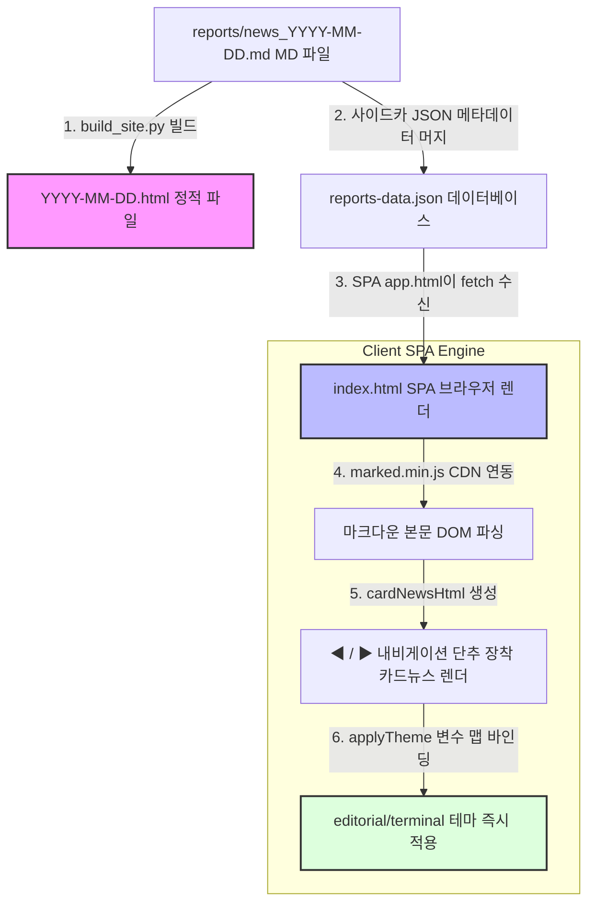

# 📰 데일리 뉴스 브리핑 — 개발자 가이드

> 코드 구조, 로직 흐름, 유지보수, 확장을 위한 개발자 참조 문서.  
> 초기 실행은 [news_readme.md](news_readme.md) 참조.

---

## 목차

1. [전체 실행 흐름](#1-전체-실행-흐름)
2. [수집 단계 (collector.py)](#2-수집-단계)
3. [AI 분석 단계 (analyzer.py)](#3-ai-분석-단계)
4. [리포트 생성 (report.py)](#4-리포트-생성)
5. [사이트 빌드 (build_site.py)](#5-사이트-빌드)
6. [프롬프트 관리 (prompts.py)](#6-프롬프트-관리)
7. [테마 시스템 (themes/)](#7-테마-시스템)
8. [이메일 발송 (mailer.py)](#8-이메일-발송)
9. [설정 파라미터 (settings.py)](#9-설정-파라미터)
10. [RSS 소스 관리](#10-rss-소스-관리)
11. [감시 키워드 관리](#11-감시-키워드-관리)
12. [LLM 교체](#12-llm-교체)
13. [자주 발생하는 문제](#13-자주-발생하는-문제)
14. [유지보수 체크리스트](#14-유지보수-체크리스트)

---

## 1. 전체 실행 흐름

```
python main.py
  │
  ▼ Step 1: collector.collect_news()
  │   ├─ 전일 캐시 로드 (.cache/last_urls.json, TTL 23h)
  │   ├─ 모든 RSS URL 수집 (타임아웃 10초, 피드당 최대 8건)
  │   ├─ 중복 URL 제거 (세션 내 + 전일 캐시)
  │   ├─ 감시 키워드 매칭 기사 → keyword_news 분리
  │   ├─ 언어 분리: en_news / ko_news
  │   └─ AI 전송용 trimmed (최대 40건, EN 60 : KO 40 비율)
  │
  ▼ Step 2: analyzer.analyze(news_data)
  │   ├─ 영어 뉴스 → _build_prompt("en") → LLM → en 결과
  │   ├─ 한국어 뉴스 → _build_prompt("ko") → LLM → ko 결과
  │   └─ _merge(en, ko) → combined
  │
  ▼ Step 3: report.generate() + report.save_report()
  │   └─ Jinja2 렌더링 → reports/news_YYYY-MM-DD.md
  │
  ▼ Step 4: db.append_news()
  │   └─ storage/news_db.xlsx 누적 저장
  │
  ▼ Step 5: mailer.send_email()
      └─ Gmail SMTP → RECIPIENT_EMAILS 수신자 개별 발송
```

---

## 2. 수집 단계

### 중복 제거 2단계

| 단계 | 방법 |
|------|------|
| 세션 내 | `seen_urls` set — 같은 URL이 여러 피드에 있으면 첫 번째만 |
| 전일 캐시 | `.cache/last_urls.json` — 23시간 이내 수집한 URL 제거 |

### collect_news() 반환 구조

```python
{
    "en":      [...],   # 영어 기사 (키워드 기사 제외)
    "ko":      [...],   # 한국어 기사 (키워드 기사 제외)
    "all":     [...],   # 전체 (키워드 기사 포함)
    "keyword": [...],   # 감시 키워드 매칭 기사
    "trim":    [...],   # AI 분석용 최대 40건
    "stats": {
        "total":           int,
        "en":              int,
        "ko":              int,
        "keyword_matches": int,
        "sent_to_ai":      int,
        "skipped_dup":     int,
    }
}
```

### 기사 데이터 구조

```python
{
    "category":  "ai_ml",
    "label":     "AI·ML",
    "lang":      "en",
    "title":     "기사 제목",
    "link":      "https://...",
    "published": "...",
    "summary":   "첫 150자",
}
```

---

## 3. AI 분석 단계

### 전략 패턴

```
get_analyzer()         ← LLM_PROVIDER 환경변수 기준
  ├─ "gemini" → GeminiAnalyzer (기본)
  ├─ "claude" → ClaudeAnalyzer
  └─ "gpt"    → GPTAnalyzer
```

### 프롬프트 구조 (h3 고정)

AI 출력은 아래 헤더 구조로 고정되어 있다. 변경 시 파서도 같이 수정해야 한다.

```
### 핵심 이슈 TOP 3
1. **[이슈 제목]** — 2~3문장 요약
   🔗 출처: [기사 제목](URL)

### 주목할 트렌드 키워드
- **[키워드]**: 설명
```

h3(`###`)을 h2(`##`)로 변경하면 `build_site.py`의 `_parse_issues()`, `_parse_keywords()` 파서가 작동하지 않는다.

### 모델 자동 선택

| LLM | 기준 | 적은 경우 | 많은 경우 |
|-----|------|-----------|-----------|
| Gemini | ≤ 40건 | gemini-3.1-flash-lite | gemini-3.1-flash-lite |
| Claude | ≤ 20건 | claude-haiku-4-5 | claude-opus-4-5 |
| GPT | ≤ 20건 | gpt-4o-mini | gpt-4o |

### AI 실패 시 폴백

API 오류 시 원문 제목 15건 목록을 삽입. 파이프라인은 중단되지 않는다.

---

## 4. 리포트 생성

### 템플릿 변수 (templates/daily_report.md)

| 변수 | 내용 |
|------|------|
| `date` | 생성 일시 |
| `analysis_en` | 영어 AI 분석 결과 |
| `analysis_ko` | 한국어 AI 분석 결과 |
| `combined` | 두 분석 합본 |
| `news_en` | 영어 기사 리스트 |
| `news_ko` | 한국어 기사 리스트 |
| `keyword_news` | 키워드 매칭 기사 |
| `stats` | 수집 통계 dict |

### 저장 경로

```
reports/news_YYYY-MM-DD.md   ← 같은 날 재실행 시 덮어씀
```

---

## 5. 사이트 빌드

### 출력 구조 (publish/)

```
publish/
  index.html          ← 최신 리포트 홈
  archive.html        ← 전체 목록
  app.html            ← 동적 웹앱 (검색·필터)
  reports.json        ← 날짜 인덱스
  reports-data.json   ← 구조화 데이터 (이슈/키워드 포함)
  stock/              ← 주식시황 HTML
  YYYY-MM-DD.html     ← 날짜별 리포트
```

### 구조화 파싱

`parse_md_for_json()`이 MD에서 아래 데이터를 추출해 `reports-data.json`에 저장:

```python
{
    "issues_en":   [{"title": ..., "body": ..., "url": ..., "url_text": ...}],
    "issues_ko":   [...],
    "keywords_en": [{"keyword": ..., "desc": ...}],
    "keywords_ko": [...],
    "structured":  {...}  # [2026-05-24 추가] 사이드카 JSON 메타데이터 병합 탑재
}
```

---

### 5-2. [2026-05-24 추가] Marked.js & 테마 연동 클라이언트 렌더링 파이프라인 (순서도)

마 마크다운 파서 깨짐 및 단락 붕괴 장애를 원천 퇴치하고, 하드코딩 없는 테마 동적 연동을 이루는 정교한 렌더링 파이프라인은 아래 순서도로 구동됩니다.



* **MARKED.JS 파서 연동 원리**: SPA 내부의 버그성 정규식 치환 `md2html`을 배제하고 글로벌 표준 마크다운 렌더러인 `marked.js` CDN을 주입해, 굵은 글씨(`**`)와 복잡한 줄바꿈이 한 치의 깨짐도 없이 완벽하게 복구되도록 인코딩 환경을 보강했습니다.
* **하드코딩 배제 설정 테마**: 서버 템플릿의 색상 토큰을 SPA `:root` 내의 `[data-theme="..."]` CSS 변수 맵으로 이식하여, 브라우저 드롭다운 패널 선택 및 칩 클릭에 하드코딩 없이 즉각 스타일시트가 동기화 변경됩니다.


---

## 6. 프롬프트 관리

`config/prompts.py`에 모든 프롬프트가 있다. `analyzer.py`와 분리되어 있다.

### 구성 요소

| 항목 | 역할 |
|------|------|
| `CATEGORY_PROMPTS` | 카테고리별 분석 힌트 (Top 2 카테고리 자동 적용) |
| `DEFAULT_PROMPT_HINT` | 매칭 카테고리 없을 때 기본 힌트 |
| `PROMPT_TEMPLATE_KO` | 한국어 뉴스용 프롬프트 |
| `PROMPT_TEMPLATE_EN` | 영어 뉴스용 프롬프트 |

### 출력 형식 변경 시 주의사항

`### 핵심 이슈 TOP 3` 헤더 레벨·문구를 변경하면 아래 파서가 같이 깨진다:
- `build_site.py::_parse_issues()`
- `build_site.py::_parse_keywords()`

헤더 고정 규칙은 프롬프트에 명시되어 있다: "반드시 이 형식 그대로 준수 — 헤더 레벨 변경 금지"

---

## 7. 테마 시스템

### 역할 분담

| 파일 | 역할 | 수정 시 목적 |
|------|------|-------------|
| `templates/*.html` | HTML 구조 (Jinja2) | 레이아웃·마크업 변경 |
| `themes/{name}.py` | 색상·폰트 토큰 (`TOKENS`) | 색상·폰트 변경 |
| `themes/base.py` | Jinja2 렌더링 엔진 | 렌더 로직 변경 |
| `config/theme_config.py` | 어떤 테마를 쓸지 (`SECTION_THEMES`) | 테마 전환 |

### 템플릿 파일 목록

```
templates/
  email_news.html         ← 뉴스 이메일 HTML (Jinja2)
  email_stock.html        ← 주식시황 이메일 HTML (Jinja2)
  web_news.html           ← 뉴스 웹페이지 HTML (Jinja2)
  web_stock.html          ← 주식시황 웹페이지 HTML (Jinja2)
  web_archive.html        ← 뉴스 아카이브 웹페이지 HTML (Jinja2)
  web_stock_archive.html  ← 주식 아카이브 웹페이지 HTML (Jinja2)
  daily_report.md         ← 뉴스 MD 리포트 템플릿 (Jinja2)
  stock_report.md         ← 주식 MD 리포트 템플릿 (Jinja2)
```

### 테마 종류

| 테마 | 방식 | 특징 |
|------|------|------|
| `classic` | 표준 (Jinja2 템플릿) | 네이비 헤더, 카드 레이아웃 (기본) |
| `ink` | 표준 (Jinja2 템플릿) | 붉은 accent, 신문 스타일 |
| `forest` | 표준 (Jinja2 템플릿) | 에메랄드 accent, 핀테크 그린 |
| `minimal` | 커스텀 레이아웃 | Pretendard, 넓은 여백, stats-row 컴포넌트 |
| `editorial` | 커스텀 레이아웃 | 신문 마스트헤드, Noto Serif KR |
| `terminal` | 커스텀 레이아웃 | Bloomberg 다크 터미널, JetBrains Mono |

**표준 테마**: `templates/web_*.html` Jinja2 템플릿 + `TOKENS` 색상 주입  
**커스텀 테마**: `themes/{name}.py`에 Python으로 자체 레이아웃 구현 (완전히 다른 HTML 구조)

### 테마 선택 방법

```bash
# 환경변수로 빌드
SITE_THEME=minimal python scripts/build_site.py

# .env에 고정
SITE_THEME=minimal

# 섹션별 독립 설정 (뉴스/주식/이메일 각각)
THEME_NEWS=editorial THEME_STOCK=terminal python scripts/build_site.py
```

### 새 테마 추가 (표준 방식)

1. `themes/{name}.py` 생성 후 `TOKENS` dict 정의 (색상·폰트)
2. `from themes.base import render_report as _report` 등으로 렌더러 위임
3. `config/theme_config.py`의 `DESIGN_TEMPLATES` 목록에 추가

### HTML 레이아웃 수정 시

```
웹페이지 레이아웃 변경  → templates/web_news.html (또는 web_stock.html 등)
이메일 레이아웃 변경    → templates/email_news.html (또는 email_stock.html)
커스텀 테마 레이아웃    → themes/editorial.py, themes/terminal.py, themes/minimal.py
```

---

## 8. 이메일 발송

### Gmail SMTP 설정

```
Google 계정 → 보안 → 2단계 인증 활성화 → 앱 비밀번호 생성
```

앱 비밀번호(16자리)를 `GMAIL_APP_PASSWORD`에 설정. 일반 비밀번호가 아님을 주의.

### 다수 수신자 발송

`RECIPIENT_EMAILS=email1,email2,email3` (쉼표 구분)  
수신자별 개별 발송 — 서로의 이메일 주소가 보이지 않음.

### 이메일 템플릿

뉴스 이메일은 `templates/email_news.html` (Jinja2)로 렌더링된다.  
HTML 구조를 바꾸려면 이 파일을 직접 수정. 색상은 테마 `TOKENS`를 통해 주입.

### mailer.py 주요 파라미터

```python
send_email(
    md_content: str,
    template: str | None = None,          # "stock" → email_stock.html 사용
    subject_override: str | None = None,  # 주식시황 등 다른 제목 사용 시
) -> bool
```

---

## 9. 설정 파라미터

`config/settings.py` 주요 값:

| 파라미터 | 기본값 | 설명 |
|----------|--------|------|
| `MAX_ENTRIES_PER_FEED` | 8 | 피드당 최대 수집 건수 |
| `MAX_TITLES_TO_ANALYZE` | 40 | AI 전달 최대 기사 수 |
| `RSS_TIMEOUT_SECONDS` | 10 | 피드 요청 타임아웃 |
| `CACHE_TTL_HOURS` | 23 | 캐시 유효 시간 |
| `GEMINI_MODEL_FULL` | gemini-3.1-flash-lite | Gemini 모델 |

---

## 10. RSS 소스 관리

`config/rss_sources.py`에서 주석 조작으로 소스 활성화/비활성화:

```python
RSS_FEEDS = {
    **KO_ECONOMY,   # 활성화
    **KO_TECH,      # 활성화
    # **KO_GENERAL, # 비활성화
}
```

### 현재 활성 소스 (2026-05-18)

| 카테고리 | 레이블 | 언어 | 피드 수 |
|----------|--------|------|---------|
| `korean_economy` | 국내 경제 | ko | 5개 |
| `korean_tech` | 국내 IT·기술 | ko | 7개 |
| `technology` | 글로벌 기술 | en | 6개 |
| `ai_ml` | AI·ML | en | 8개 |

---

## 11. 감시 키워드 관리

`config/keywords.py`의 `WATCH_KEYWORDS` 목록에 포함된 기사를 AI 분석에서 제외하고 리포트 별도 섹션에 표시.

```python
WATCH_KEYWORDS: list[str] = [
    "정보통신산업진흥원",
    "nipa",
    "과학기술정보통신부",
    "과기정통부",
]
```

키워드 기사는 `keyword_news` 버킷으로 분리 → xlsx DB에는 저장, AI 분석에는 제외.

---

## 12. LLM 교체

```bash
# Gemini (기본)
LLM_PROVIDER=gemini
GEMINI_API_KEY=AIza...

# Claude
LLM_PROVIDER=claude
ANTHROPIC_API_KEY=sk-ant-...

# GPT
LLM_PROVIDER=gpt
OPENAI_API_KEY=sk-...
```

모델명 변경은 `config/settings.py`에서:

```python
GEMINI_MODEL_FULL = "gemini-2.0-flash"   # 안정 버전으로 교체 시
```

---

## 13. 자주 발생하는 문제

### 수집 뉴스 0건

1. 캐시 초기화: `del .cache\last_urls.json` 후 재실행
2. RSS_TIMEOUT_SECONDS 값 증가 (10 → 20)
3. 피드 URL 직접 확인: `python -c "import feedparser; print(feedparser.parse('URL').entries[:3])"`

### AI 분석 실패 (fallback 출력)

1. API 키 확인 (`.env` 파일)
2. Gemini: 일일 무료 할당량 초과 시 → 다음 날 자동 복구
3. Gemini 모델명 만료 시 → `settings.py`에서 `gemini-2.0-flash`로 교체
4. **재분석**: GitHub Actions → news.yml → Run workflow
   - `mode`: `reanalyze`
   - `target_date`: 재분석할 날짜 (예: `2026-06-01`)
   - `reanalyze_mode`: `smart`(실패 항목만) 또는 `full`(전체 초기화)

### 키워드 섹션이 비어 있음

`max_tokens=800` 이하로 설정되어 있으면 AI가 이슈 3개를 쓰고 키워드 섹션을 잘라낸다.  
`core/analyzer.py`의 모든 Analyzer에서 `max_tokens=1500` 이상으로 설정할 것.

### GitHub Pages 배포 안 됨

`Settings → Pages → Source`가 `GitHub Actions`인지 확인. `Deploy from a branch`이면 동작 안 함.

### 이메일 발송 실패

1. `GMAIL_APP_PASSWORD`가 일반 비밀번호가 아닌 앱 비밀번호(16자리)인지 확인
2. 2단계 인증이 활성화되어 있는지 확인

---

## 14. 유지보수 체크리스트

### 월 1회

- [ ] RSS 피드 응답 없는 URL 확인 후 주석 처리
- [ ] `.cache/last_urls.json` 크기 확인 (과도하면 삭제)
- [ ] Gemini 모델명 만료 여부 확인
- [ ] API 비용 확인 (LLM 대시보드)

### 분기 1회

- [ ] `requirements.txt` 패키지 버전 업데이트 검토
- [ ] GitHub Actions 워크플로우 구문 오류 없는지 테스트 실행

---

*최종 업데이트: 2026-06-03*
