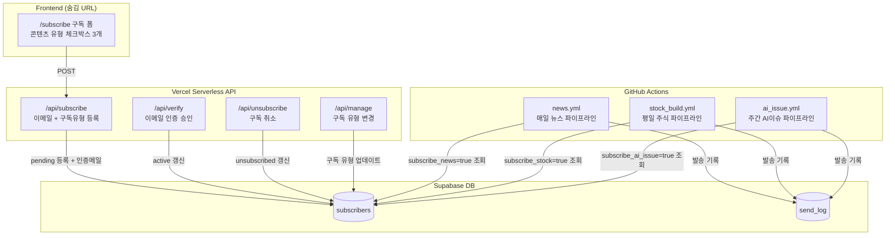

# 📋 Supabase 기반 구독 제어 시스템 구축 기획서 v2

> **목적**: Supabase DB + Vercel Serverless API로 구독 라이프사이클 완전 자동화, 콘텐츠 유형별(뉴스/주식/AI이슈) 선택 구독, AI 분석 품질 게이트, 재분석·재발송 관리 기능 포함  
> **파일**: `docs/plan/plan_subscription_system.md`  
> **최초 작성**: 2026-05-29 / **v2 업데이트**: 2026-06-02  
> **인프라 전제**: 별도 서버 없음 — GitHub Actions + Vercel Serverless + Supabase만 사용

> ### ✅ 구현 완료 (2026-06-10)
> 핵심 구독 흐름 구현 완료. 미구현 항목은 향후 보강 예정.
>
> | 기능 | 상태 |
> |------|------|
> | DB 스키마 (subscribers, subscription_tokens) | ✅ |
> | RLS 활성화 | ✅ |
> | `POST /api/subscribe` 구독 신청 | ✅ |
> | `GET /api/confirm` 이메일 더블 옵트인 | ✅ |
> | `GET /api/unsubscribe` 구독 취소 | ✅ |
> | `GET/POST /api/manage` 채널 관리 | ✅ |
> | `/subscribe` 구독 페이지 | ✅ |
> | `mailer.py` Supabase 구독자 조회 | ✅ |
> | 관리자 시스템 (is_admin, send_admin_alert) | ✅ |
> | AI 분석 품질 게이트 연동 | ⬜ 미구현 |
> | 재분석·재발송 관리 UI | ⬜ 미구현 |

---

## 💡 1. 핵심 아키텍처 개요



---

## 🛠️ 2. Supabase DB 설계

### 2-1. subscribers 테이블

```sql
create table subscribers (
  id               uuid default gen_random_uuid() primary key,
  email            text unique not null,
  status           text not null default 'pending',
  -- status: 'pending' | 'active' | 'unsubscribed'
  token            text not null unique,  -- 인증·취소·관리 공용 보안 토큰

  -- 콘텐츠별 구독 선택 (기본: 뉴스만 true)
  subscribe_news      boolean not null default true,
  subscribe_stock     boolean not null default false,
  subscribe_ai_issue  boolean not null default false,

  created_at       timestamptz default timezone('utc', now()) not null,
  verified_at      timestamptz,
  unsubscribed_at  timestamptz
);

alter table subscribers enable row level security;

create policy "Allow public insert"        on subscribers for insert with check (true);
create policy "Allow select by token"      on subscribers for select using (true);
create policy "Allow update status by token" on subscribers for update using (true);
```

### 2-2. send_log 테이블

발송 이력 기록. 재발송 중복 방지 및 관리 UI에서 상태 표시에 사용.

```sql
create table send_log (
  id           uuid default gen_random_uuid() primary key,
  content_type text not null,  -- 'news' | 'stock' | 'ai_issue'
  report_date  date not null,
  channel      text not null,  -- 'email' | 'telegram' | 'notion'
  status       text not null,  -- 'sent' | 'skipped' | 'failed'
  recipient_count int,
  analysis_ok  boolean,        -- AI 분석 성공 여부
  sent_at      timestamptz default timezone('utc', now())
);
```

---

## 🔒 3. AI 분석 품질 게이트 (신규)

### 3-1. 리포트 JSON에 분석 상태 플래그 추가

`reports/news/news_YYYY-MM-DD.json` 등 모든 리포트 JSON에 아래 필드 포함:

```json
{
  "date": "2026-06-02",
  "analysis_ok": true,
  "fallback_used": false,
  "en": { ... },
  "ko": { ... }
}
```

- `analysis_ok`: LLM이 정상 JSON을 반환한 경우 `true`
- `fallback_used`: `_fallback_summary()` 가 사용된 경우 `true`

### 3-2. 발송 스크립트 품질 게이트

```python
# send_news_email.py, send_stock_email.py, send_ai_issue_email.py 공통 패턴
import json

def load_report_with_gate(report_json_path: str) -> dict | None:
    with open(report_json_path) as f:
        data = json.load(f)
    if not data.get("analysis_ok", False):
        logger.warning(f"[품질게이트] AI 분석 실패 리포트 — 발송 건너뜀: {report_json_path}")
        _notify_admin_failure(report_json_path)  # 관리자에게 실패 알림만 발송
        return None
    return data
```

### 3-3. 분석 실패 시 관리자 알림

전체 발송 대신 `GMAIL_USER` (관리자)에게만 실패 요약 메일 발송:

```
제목: [DailyNews] ⚠ 2026-06-02 뉴스 분석 실패 — 재분석 필요
내용: EN 분석 실패 (fallback 사용)
      재분석: https://github.com/owner/repo/actions/workflows/news.yml
```

### 3-4. 워크플로우 중복 트리거 방지

Actions 봇 커밋에 `[skip ci]` 추가:

```yaml
git commit -m "📰 News build $(date +'%Y-%m-%d') [skip ci]"
```

---

## ⚙️ 4. Vercel Serverless API 구현

### 4-1. `/api/subscribe` — 구독 신청

- 이메일 + 구독 유형 3개(체크박스) 수신
- 암호학적 토큰 생성 (`secrets.token_urlsafe(16)`)
- Supabase에 `pending` 등록 (재구독 시 토큰·상태 갱신)
- Double Opt-In 인증 메일 발송

```python
# 요청 body 예시
{
  "email": "user@example.com",
  "subscribe_news": true,
  "subscribe_stock": false,
  "subscribe_ai_issue": true
}
```

### 4-2. `/api/verify` — 이메일 인증

- `?token=xxx` 파라미터로 `pending` → `active` 갱신
- `verified_at` 기록
- "구독 완료" HTML 응답 + 3초 후 홈으로 리다이렉트

### 4-3. `/api/unsubscribe` — 구독 취소

- `?token=xxx` 파라미터로 `active` → `unsubscribed` 갱신
- `unsubscribed_at` 기록
- GitHub Contents API 방식 완전 폐기

### 4-4. `/api/manage` — 구독 유형 변경 (신규)

- `?token=xxx`로 현재 구독 유형 조회
- POST body로 구독 유형 업데이트
- 메일 하단 "구독 설정 변경" 링크에서 접근

```python
# GET: 현재 설정 조회
# POST body: { "subscribe_news": true, "subscribe_stock": true, "subscribe_ai_issue": false }
```

---

## 📧 5. 발송 엔진 개편 (콘텐츠별 수신자 분리)

### 5-1. `core/shared/mailer.py` 변경안

```python
SUPABASE_URL = os.getenv("SUPABASE_URL")
SUPABASE_KEY = os.getenv("SUPABASE_SERVICE_ROLE_KEY")

def get_recipients(content_type: str, mode: str = "prod") -> list[str]:
    """
    content_type: 'news' | 'stock' | 'ai_issue'
    mode: 'test' | 'prod'
    """
    if mode == "test":
        emails = os.getenv("TEST_RECIPIENT_EMAILS", "")
        return [e.strip() for e in emails.split(",") if e.strip()]

    if not SUPABASE_URL or not SUPABASE_KEY:
        logger.warning("[Supabase 미설정] RECIPIENT_EMAILS 환경변수로 폴백")
        return [e.strip() for e in os.getenv("RECIPIENT_EMAILS", "").split(",") if e.strip()]

    col_map = {
        "news":     "subscribe_news",
        "stock":    "subscribe_stock",
        "ai_issue": "subscribe_ai_issue",
    }
    filter_col = col_map.get(content_type, "subscribe_news")

    supabase = create_client(SUPABASE_URL, SUPABASE_KEY)
    resp = (supabase.table("subscribers")
            .select("email")
            .eq("status", "active")
            .eq(filter_col, True)
            .execute())
    emails = [row["email"] for row in resp.data]
    logger.info(f"[{content_type}] 구독자 {len(emails)}명 조회 완료")
    return emails
```

### 5-2. 각 발송 스크립트 호출 변경

| 스크립트 | 변경 전 | 변경 후 |
|---|---|---|
| `send_news_email.py` | `RECIPIENT_EMAILS` 직접 사용 | `get_recipients("news", mode)` |
| `send_stock_email.py` | `RECIPIENT_EMAILS` 직접 사용 | `get_recipients("stock", mode)` |
| `send_ai_issue_email.py` | `RECIPIENT_EMAILS` 직접 사용 | `get_recipients("ai_issue", mode)` |

---

## 🚀 6. 워크플로우 발송 모드 분리

### 6-1. MAIL_MODE 분기 로직

| 트리거 | MAIL_MODE | 수신자 |
|---|---|---|
| `push` (코드 커밋) | `test` | `TEST_RECIPIENT_EMAILS` 만 |
| `schedule` (정기 cron) | `prod` | Supabase active 구독자 전원 |
| `workflow_dispatch` | 입력값 (`test`/`prod`) | 선택에 따라 |

### 6-2. workflow YAML 공통 패턴 (3개 워크플로우 동일)

```yaml
workflow_dispatch:
  inputs:
    mail_mode:
      description: '발송 모드 (test: 개발자 전용 / prod: 전체 구독자)'
      required: false
      default: 'test'
    date:
      description: '재처리 날짜 (YYYY-MM-DD, 비워두면 오늘)'
      required: false
      default: ''
    step:
      description: '실행 단계 (all / analyze / publish)'
      required: false
      default: 'all'
```

```yaml
- name: 이메일 발송
  env:
    MAIL_MODE: >-
      ${{
        github.event_name == 'schedule' && 'prod' ||
        (github.event_name == 'workflow_dispatch' && github.event.inputs.mail_mode) ||
        'test'
      }}
    TEST_RECIPIENT_EMAILS: ${{ secrets.TEST_RECIPIENT_EMAILS }}
    SUPABASE_URL: ${{ secrets.SUPABASE_URL }}
    SUPABASE_SERVICE_ROLE_KEY: ${{ secrets.SUPABASE_SERVICE_ROLE_KEY }}
```

---

## 🔁 7. 재분석·재발송 관리 기능 (신규)

서버 없이 GitHub Actions `workflow_dispatch`의 inputs 확장으로 구현합니다.

### 7-1. workflow_dispatch 확장 입력값

```yaml
workflow_dispatch:
  inputs:
    date:
      description: '재처리 날짜 (YYYY-MM-DD, 비워두면 오늘)'
      default: ''
    step:
      description: '실행 단계'
      type: choice
      options:
        - all          # 수집 + 분석 + 발송
        - collect      # 수집만 (RSS 재수집)
        - analyze      # 분석만 (기존 수집 데이터 재분석)
        - publish      # 발송만 (기존 분석 결과로 발송)
      default: 'all'
    channels:
      description: '발송 채널'
      type: choice
      options:
        - all          # 이메일 + 텔레그램
        - email
        - telegram
        - none         # 빌드만, 발송 안 함
      default: 'all'
    mail_mode:
      description: '발송 대상 (test/prod)'
      type: choice
      options: [prod, test]
      default: 'prod'
```

### 7-2. 스크립트 분기 처리

```python
# run_news.py 내 분기 예시
import os

STEP = os.getenv("STEP", "all")
TARGET_DATE = os.getenv("TARGET_DATE") or datetime.now().strftime("%Y-%m-%d")

if STEP in ("all", "collect"):
    news_data = collector.collect()
    save_raw(news_data, TARGET_DATE)
else:
    news_data = load_raw(TARGET_DATE)  # 기존 수집 데이터 로드

if STEP in ("all", "analyze"):
    result = analyzer.analyze(news_data)
    save_report(result, TARGET_DATE)
    analysis_ok = result.get("analysis_ok", False)
else:
    result = load_report(TARGET_DATE)
    analysis_ok = result.get("analysis_ok", False)

if STEP in ("all", "publish") and analysis_ok:
    if CHANNELS in ("all", "email"):
        mailer.send(result, content_type="news", mode=MAIL_MODE)
    if CHANNELS in ("all", "telegram"):
        telegram.send(result)
```

---

## 🌐 8. 구독 폼 UI (숨김 페이지)

페이지 내비게이션에는 노출하지 않고 직접 URL로만 접근 가능.

```
https://your-site.vercel.app/subscribe
```

폼 구성:
```html
<form action="/api/subscribe" method="POST">
  <input type="email" name="email" placeholder="이메일 주소" required>
  
  <fieldset>
    <legend>받고 싶은 뉴스레터 선택</legend>
    <label><input type="checkbox" name="subscribe_news"      checked> 📰 데일리 뉴스 브리핑 (매일)</label>
    <label><input type="checkbox" name="subscribe_stock"           > 📊 주식 시황 브리핑 (평일)</label>
    <label><input type="checkbox" name="subscribe_ai_issue"        > 🤖 AI 이슈 위클리 (주 1회)</label>
  </fieldset>
  
  <button type="submit">구독 신청</button>
</form>
```

---

## 🔑 9. 추가 환경변수 (GitHub Secrets)

| 변수명 | 용도 |
|---|---|
| `SUPABASE_URL` | Supabase 프로젝트 URL |
| `SUPABASE_SERVICE_ROLE_KEY` | RLS 우회용 서비스 롤 키 (서버 전용) |
| `SUPABASE_ANON_KEY` | 프론트엔드 공개 키 (구독 폼 AJAX용) |
| `TEST_RECIPIENT_EMAILS` | 테스트 모드 수신자 (쉼표 구분) |

---

## 📅 10. 구현 마일스톤

### Phase 1 — 품질 게이트 + 중복 트리거 방지 (즉시 적용 가능)
- [ ] 리포트 JSON에 `analysis_ok`, `fallback_used` 플래그 추가
- [ ] 발송 스크립트에 품질 게이트 로직 추가
- [ ] 분석 실패 시 관리자 알림 메일 발송
- [ ] 워크플로우 봇 커밋에 `[skip ci]` 추가

### Phase 2 — Supabase 구독자 관리
- [ ] Supabase 프로젝트 생성 + `subscribers`, `send_log` 테이블 생성
- [ ] `/api/subscribe`, `/api/verify`, `/api/unsubscribe` 구현
- [ ] `mailer.py` 수신자 조회 로직 Supabase로 전환
- [ ] `MAIL_MODE` 분기 각 워크플로우에 적용
- [ ] `/subscribe` 숨김 폼 페이지 생성

### Phase 3 — 재분석·재발송 관리
- [ ] `workflow_dispatch` inputs 3개 워크플로우 모두 확장
- [ ] `run_news.py`, `run_stock.py`, `run_ai_issue.py` STEP/CHANNELS 분기 추가
- [ ] `/api/manage` 구독 유형 변경 API 구현
- [ ] `send_log` 테이블 연동 (발송 이력 기록)

### Phase 4 — Admin UI (선택, 장기)
- [ ] 날짜별 리포트 상태 대시보드
- [ ] 재분석/재발송 버튼 UI
- [ ] 구독자 관리 화면
