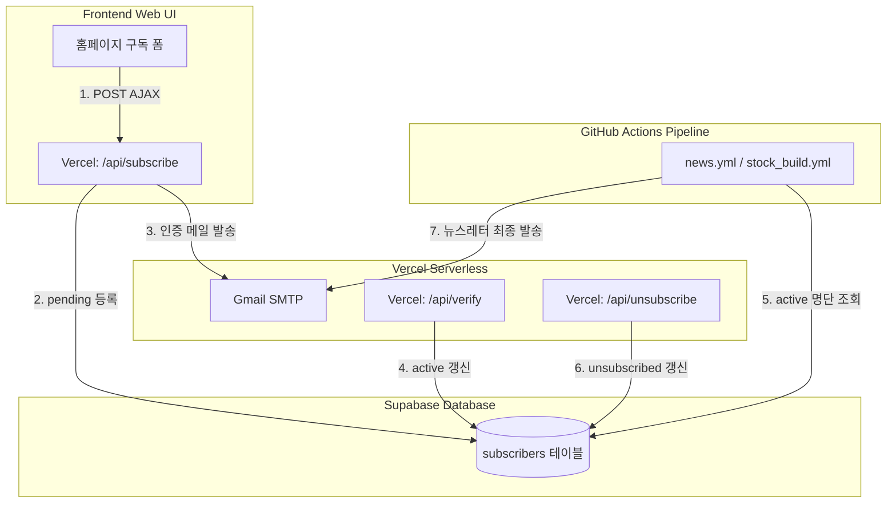

# 📋 Supabase 기반 구독 제어 시스템 및 메일 테스트 분리 구축 기획서

> **목적**: Supabase Serverless DB 연동을 통한 구독 라이프사이클(가입-인증-발송-취소) 완전 자동화 및 테스트/실서비스 메일링 워크플로우 분리  
> **대상 폴더**: `docs/plan/plan_subscription_system.md`  
> **작성일**: 2026-05-29  
> **작성자**: Antigravity (AI Co-Pilot)

본 기획서는 별도의 유료 백엔드 웹 서버 구동 없이 **Supabase Serverless DB**와 **Vercel Serverless API**만을 유기적으로 엮어 구독 신청, 이중 승인(Double Opt-In), 구독 취소 라이프사이클을 안전하게 구현하고, GitHub Actions의 메일링 파이프라인을 개선하여 **커밋 테스트 시의 스팸성 전체 발송을 원천 방지하고 개발자 전용 검증 단계를 분리**하는 설계 가이드라인입니다.

---

## 💡 1. 핵심 아키텍처 개요

본 시스템은 정적 프론트엔드(GitHub Pages)와 무상태(Stateless) 백엔드 파이프라인(Actions)의 한계를 극복하기 위해, **PostgreSQL REST API**를 내장한 Supabase 데이터베이스 레이어를 도입합니다.



---

## 🛠️ 2. Supabase DB 설계 (Database Layer)

이메일 평문을 임의 노출하지 않고 악의적인 조작을 방지하기 위해, 고유 **인증 보안 토큰(`token`)**을 매핑하여 가입 및 해지를 처리합니다.

### 데이터베이스 테이블 정의 (`subscribers`)
```sql
create table subscribers (
  id uuid default gen_random_uuid() primary key,
  email text unique not null,
  status text not null default 'pending', -- 'pending' (인증 대기), 'active' (구독중), 'unsubscribed' (구독 취소)
  token text not null unique,              -- 인증 및 구독 취소에 사용할 1회성/보안용 랜덤 보안 토큰
  created_at timestamp with time zone default timezone('utc'::text, now()) not null,
  verified_at timestamp with time zone,
  unsubscribed_at timestamp with time zone
);

-- Row Level Security (RLS) 활성화
alter table subscribers enable row level security;

-- RLS 정책(Policy) 수립
-- 1. 홈페이지 구독 폼을 통한 익명(Anon) 인서트 허용
create policy "Allow public insert" on subscribers for insert with check (true);
-- 2. 토큰을 검증 필터로 활용한 조회 및 상태 업데이트 허용
create policy "Allow select by token" on subscribers for select using (true);
create policy "Allow update status by token" on subscribers for update using (true);
```

---

## ⚙️ 3. Vercel Serverless API 구현 (Lifecycle Handlers)

`api/` 폴더 하위의 Python 서버리스 함수를 통해 데이터 입력 및 인증 확인을 제어합니다.

### 3-1. 구독 신청 처리 (`/api/subscribe`)
* **기능**: 사용자의 구독 요청을 받아 고유 토큰을 발급하고 Supabase에 `pending` 상태로 기록한 뒤, 확인 이메일을 발송합니다.
* **주요 비즈니스 로직**:
  1. 이메일 유효성 및 봇 차단 간이 필터링.
  2. 암호학적으로 안전한 1회성 토큰 생성 (`secrets.token_urlsafe(16)`).
  3. Supabase DB에 인서트 (기존 존재 여부를 판별해 기존 이력이 `unsubscribed` 상태인 경우 토큰과 상태 갱신).
  4. SMTP 메일러를 기동하여 더블 옵트인 인증 URL(`{SITE_BASE_URL}/api/verify?token=토큰`)이 포함된 예쁜 HTML 안내 메일을 발송합니다.

### 3-2. 구독 인증 자동 승인 (`/api/verify`)
* **기능**: 사용자가 메일함에서 인증 버튼을 클릭했을 때의 비동기 처리 진입점입니다.
* **주요 비즈니스 로직**:
  1. URL의 `token` 파라미터 캡처.
  2. Supabase DB에서 해당 토큰을 보유한 `status = 'pending'` 레코드 조회.
  3. 성공 시 상태를 `active`로 변경하고 `verified_at` 기록.
  4. 깔끔하고 직관적인 "구독 승인 완료" HTML 안내 페이지를 띄우고 3초 후 메인 홈 대시보드로 자동 리다이렉트합니다.

### 3-3. 초고속 구독 취소 (`/api/unsubscribe`)
* **기능**: 메일 하단 링크 클릭 시 Supabase DB 상태를 `unsubscribed`로 다이렉트 업데이트합니다.
* **주요 비즈니스 로직**:
  1. 메일 하단의 고유 인증 취소 링크(`{SITE_BASE_URL}/api/unsubscribe?token=토큰`)를 클릭하여 진입합니다.
  2. 토큰 조회를 통해 `status = 'active'` 상태인 사용자를 `status = 'unsubscribed'` 및 `unsubscribed_at = now()`로 즉각 업데이트합니다.
  3. **(개선)** 기존의 느리고 충돌을 유발하던 GitHub Contents API 커밋 방식을 **완전 폐기**하여, 배포 딜레이 없는 초고속 구독 취소 경험을 제공합니다.

---

## 📧 4. 뉴스레터 발송 엔진 개편 (Mailing Layer)

`core/shared/mailer.py` 내의 수신자 조회 로직을 Supabase 실시간 연동으로 전환하고, **테스트 모드 분리 장치**를 장착합니다.

### 4-1. `core/shared/mailer.py` 주요 변경안
실행 환경변수 `MAIL_MODE`를 판별하여 발송 모드를 안전하게 분기합니다.

```python
import os
from supabase import create_client, Client

SUPABASE_URL = os.getenv("SUPABASE_URL")
SUPABASE_KEY = os.getenv("SUPABASE_SERVICE_ROLE_KEY") # RLS 우회용 서비스 롤 키

def _get_recipients(mode: str = "test") -> list[str]:
    """실행 모드에 따른 이메일 수신자 명단 추출"""
    # 1. 테스트 모드 (커밋 테스트)
    if mode == "test":
        test_emails = os.getenv("TEST_RECIPIENT_EMAILS", "")
        recipients = [e.strip() for e in test_emails.split(",") if e.strip()]
        logger.info(f"[테스트 메일 모드] 수신자: {recipients}")
        return recipients
        
    # 2. 프로덕션 서비스 모드 (실 서비스 발송)
    if not SUPABASE_URL or not SUPABASE_KEY:
        logger.error("[Supabase] 설정이 불완전하여 기본 환경변수 백업으로 전환합니다.")
        return RECIPIENT_EMAILS # fallback
        
    try:
        supabase: Client = create_client(SUPABASE_URL, SUPABASE_KEY)
        # active 구독자만 고속 필터링 조회
        response = supabase.table("subscribers").select("email").eq("status", "active").execute()
        recipients = [row["email"] for row in response.data]
        logger.info(f"[프로덕션 메일 모드] 활성 구독자 조회 완료: {len(recipients)}명")
        return recipients
    except Exception as e:
        logger.error(f"[Supabase 구독자 Fetch 에러] {e}")
        return []
```

---

## 🚀 5. 테스트 vs 실제 발송 워크플로우 분리 (CI/CD Pipeline Layer)

가장 큰 문제였던 **"단순 코드 커밋/푸시 시에도 무조건 전체 발송되어 스팸이 되는 문제"**를 해결합니다.

### 5-1. 워크플로우 발송 모드 정의
* **`test` 모드 (개발 확인용)**:
  * 대상: 단순히 `main` 브랜치에 코드를 push한 경우 또는 Pull Request가 돌 때.
  * 결과: 사이트 빌드 검증을 모두 수행하되, 이메일은 오직 **테스트용 개인 메일 2개(`TEST_RECIPIENT_EMAILS`)로만 발송**되어 레이아웃 정상 여부를 자가 진단합니다.
* **`prod` 모드 (실제 정기 배포 서비스)**:
  * 대상: 깃허브 액션 크론(스케줄러) 정기 구동 시점 또는 수동으로 실제 발송을 승인한 경우 (`workflow_dispatch` 트리거).
  * 결과: Supabase DB의 전체 Active 구독자 명단을 긁어와 전체에 뉴스레터를 안전하게 자동 배포합니다.

### 5-2. `.github/workflows/` 내 YAML 수정 설정
`news.yml` 및 `stock_build.yml` 내 수동 발송 옵션 탑재와 `MAIL_MODE` 분기 처리입니다.

```yaml
on:
  push:
    branches:
      - main
  schedule:
    - cron: '15 23 * * *'  # 오전 08:15 KST 정기 배포 (Production)
  workflow_dispatch:      # 수동 트리거 패널
    inputs:
      mail_mode:
        description: '발송 모드 지정 (test: 개발자 전용 / prod: 전체 구독자)'
        required: true
        default: 'test'
```

#### 이메일 발송 Step의 환경변수 동적 판별
```yaml
      - name: 이메일 발송
        run: python scripts/run_news.py
        env:
          # schedule 구동 시엔 무조건 prod, 수동 실행 시엔 입력값 적용, 단순 push(commit) 시엔 test로 분기
          MAIL_MODE: >-
            ${{ 
              github.event_name == 'schedule' && 'prod' || 
              (github.event_name == 'workflow_dispatch' && github.event.inputs.mail_mode) || 
              'test' 
            }}
          TEST_RECIPIENT_EMAILS: ${{ secrets.TEST_RECIPIENT_EMAILS }}
          SUPABASE_URL: ${{ secrets.SUPABASE_URL }}
          SUPABASE_SERVICE_ROLE_KEY: ${{ secrets.SUPABASE_SERVICE_ROLE_KEY }}
          GMAIL_USER: ${{ secrets.GMAIL_USER }}
          GMAIL_APP_PASSWORD: ${{ secrets.GMAIL_APP_PASSWORD }}
```

---

## 🎯 6. 검증 및 향후 마일스톤

### 1단계: 로컬/테스트 검증
* `main` 브랜치에 임의의 커스텀 커밋을 Push하여 워크플로우를 자동 구동합니다.
* Actions 로그에서 `[테스트 메일 모드] 수신자: ['개인메일1', '개인메일2']`가 정상 매핑되고, 두 메일함으로만 이메일이 무사 도달하는지 확인하여 스팸 0%를 확립합니다.

### 2단계: 홈페이지 구독 신청 및 승인 검증
* 홈페이지 테스트 화면에서 이메일 구독 폼을 접수하여 Supabase DB에 `pending` 레코드가 정상 등록되는지 모니터링합니다.
* 개인 메일로 수신된 인증 버튼을 클릭했을 때 Vercel 서버리스가 DB 상태를 `active`로 즉각 승인 변경하는지 데이터 검증을 수행합니다.

### 3단계: 원클릭 구독 취소 검증
* 수신된 이메일 하단의 구독 취소 단추를 눌러 Supabase DB 내 `status = 'unsubscribed'`로 즉각 갱신되는지 확인하여 구독 해지 라이프사이클을 완성합니다.
