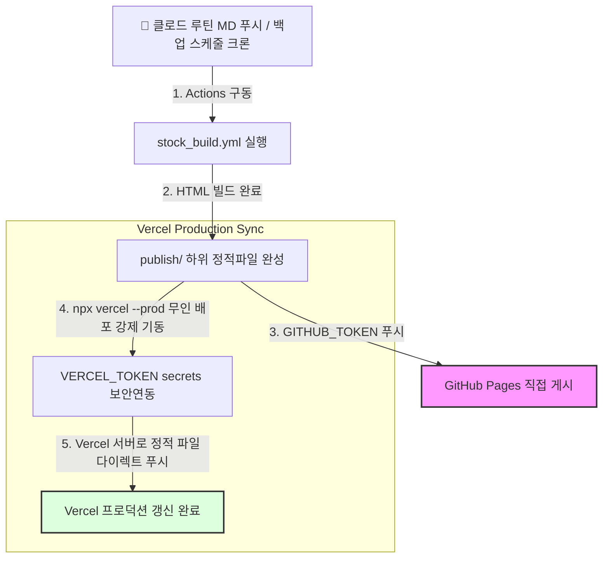

# 📊 AI News Brief — 주식시황 브리핑 개발자 가이드

> 코드 구조, 파싱 로직, 유지보수를 위한 개발자 참조 문서.  
> 빠른 시작은 [stock_readme.md](stock_readme.md) 참조.

---

## 목차

1. [파일 구조](#1-파일-구조)
2. [Primary 경로: Claude 루틴](#2-primary-경로-claude-루틴)
3. [Backup 경로: GitHub Actions 자동화](#3-backup-경로-github-actions-자동화)
4. [데이터 수집 (stock_collector.py)](#4-데이터-수집)
5. [AI 분석 (stock_analyzer.py)](#5-ai-분석)
6. [리포트 생성 (stock_report.py)](#6-리포트-생성)
7. [사이트 빌드 (build_stock_site.py)](#7-사이트-빌드)
8. [이메일 발송 (send_stock_email.py)](#8-이메일-발송)
9. [GitHub Actions 워크플로우](#9-github-actions-워크플로우)
10. [리포트 파싱 규칙](#10-리포트-파싱-규칙)
11. [자주 발생하는 문제](#11-자주-발생하는-문제)

---

## 1. 파일 구조

```
config/
  stock_prompts.py         ← 루틴 프롬프트 + LLM 분석 프롬프트 + 티커 정의
  settings.py              ← STOCK_REPORTS_DIR, STOCK_EMAIL_SUBJECT, NAVER_*
  theme_config.py          ← SECTION_THEMES["stock"] 으로 웹 테마 선택

templates/                 ← 모든 HTML/MD 템플릿 (한 곳 집중)
  stock_report.md          ← Jinja2 주식 MD 리포트 템플릿 (섹션 구조 기준)
  email_stock.html         ← 주식 이메일 HTML 템플릿 (Jinja2)
  web_stock.html           ← 주식 웹페이지 HTML 템플릿 (Jinja2)
  web_stock_archive.html   ← 주식 아카이브 웹페이지 HTML 템플릿 (Jinja2)

themes/
  {name}.py                ← 색상·폰트 TOKENS (디자인 토큰)
  base.py                  ← Jinja2 렌더링 엔진

core/
  stock/collector.py       ← yfinance 데이터 수집
  stock/analyzer.py        ← LLM 분석 + 섹션 파싱
  stock/report.py          ← Jinja2 렌더링 + MD 저장
  shared/mailer.py         ← 이메일 발송 (templates/email_stock.html 사용)

scripts/
  run_stock.py             ← 권장 진입점 (수집→분석→저장→이메일)
  build_stock_site.py      ← stock MD → HTML 빌드 (themes/ + templates/ 사용)
  send_stock_email.py      ← push 트리거 경로 이메일 발송

.github/workflows/
  stock_build.yml          ← push 트리거 + 정기 백업 워크플로우 (KST 23:00)
  stock_send.yml           ← 익일 KST 08:00 이메일 + Notion 발송

docs/
  stock_routine_prompt_v5.md  ← Claude Code 루틴 프롬프트 (루틴에 그대로 붙여넣기)

reports/stock/
  stock_YYYY-MM-DD.md      ← 날짜별 주식시황 리포트 (루틴 또는 자동화 생성)

publish/stock/
  index.html               ← 최신 주식시황 페이지
  archive.html             ← 전체 목록
  YYYY-MM-DD.html          ← 날짜별 페이지
  stock-data.json          ← 구조화 데이터
```

---

## 2. Primary 경로: Claude 루틴

Claude Code 웹 구독을 활용. API 키 불필요. MCP 도구 필요.

### 필요한 MCP 도구

| MCP | 용도 |
|-----|------|
| PlayMCP UsStockInfo | get_stock_info / get_historical_stock_prices 로 지수·종목 수집 |
| NaverSearch | search_news 로 국내 뉴스 헤드라인 수집 |

### 루틴 실행 흐름 (v5)

```
Step 1: UsStockInfo.get_stock_info × 8
        → ^KS11, ^KQ11, KRW=X, ^GSPC, ^IXIC, ^DJI, ^TNX, CL=F

Step 2: UsStockInfo.get_historical_stock_prices(period="1d") × 7
        → 섹터 대표 1종목: 삼성전자, 엔비디아, HD현대일렉트릭,
          한화에어로스페이스, ISRG, 일라이릴리, KB금융

Step 3: NaverSearch.search_news → "코스피 오늘 증시 시황" 5건

Step 4: Claude 분석 (핵심요약·온도계·키워드·주목섹터·리스크)

Step 5: Write → reports/stock/stock_YYYY-MM-DD.md

Step 6: git push → stock_build.yml push 트리거 발동
```

> **최적화 포인트**: Notion 등록은 GitHub Actions(stock_send.yml)에 위임.
> MCP 호출 수: 기존 39회 → 약 15회로 단축.

### git push 후 자동 처리

`reports/stock/**.md` push 감지 시 `stock_build.yml`이 즉시 실행:
1. `scripts/update_history.py` — 티커 이력 업데이트
2. `scripts/build_stock_site.py` — HTML 빌드
3. `scripts/build_site.py` — 뉴스 사이트도 재빌드
4. git commit + GitHub Pages 배포

익일 KST 08:00에 `stock_send.yml`이 실행:
1. `scripts/send_stock_email.py` — 이메일 발송 (품질 게이트 포함, `continue-on-error: true`)
2. `scripts/sync_notion.py` — Notion 주식시황 DB 동기화 (`continue-on-error: true`)
3. [예정] 텔레그램 발송 (stub)

---

## 3. Backup 경로: GitHub Actions 자동화

Primary 경로(루틴)가 실행되지 않은 날 **KST 23:00**에 자동 실행.

```
cron: '0 14 * * 1-5'   ← UTC 14:00 = KST 23:00 (평일)
```

### 실행 흐름 (scripts/stock_main.py)

```python
build_stock_data()       # stock_collector.py — yfinance + Naver News API
  │
  ▼
analyze_stock(data)      # stock_analyzer.py — Gemini 분석
  │
  ▼
generate(data, analysis) # stock_report.py — Jinja2 렌더링
  │
  ▼
save(md, date_str)       # reports/stock/stock_YYYY-MM-DD.md
  │
  ▼
send_email(md, subject_override=STOCK_EMAIL_SUBJECT)
```

---

## 4. 데이터 수집

### core/stock_collector.py

```python
collect_market_data()   → MARKET_TICKERS (지수/환율/금리/유가)
collect_sectors()       → SECTOR_TICKERS (섹터 대표 종목)
collect_news_ko(query)  → Naver News API (NAVER_CLIENT_ID/SECRET 필요)
build_stock_data()      → 전체 통합 dict 반환
```

### 티커 목록 (config/stock_prompts.py)

```python
MARKET_TICKERS = {
    "kospi":   "^KS11",   # 코스피
    "kosdaq":  "^KQ11",   # 코스닥
    "usd_krw": "KRW=X",   # 원/달러
    "sp500":   "^GSPC",   # S&P 500
    "nasdaq":  "^IXIC",   # 나스닥
    "dow":     "^DJI",    # 다우존스
    "us10y":   "^TNX",    # 미 10년물 금리
    "wti":     "CL=F",    # WTI 유가
}

SECTOR_TICKERS = {
    "삼성전자":       "005930.KS",
    "SK하이닉스":    "000660.KS",
    "엔비디아":       "NVDA",
    "LG에너지솔루션": "373220.KS",
    "삼성SDI":        "006400.KS",
    "삼성바이오로직스":"207940.KS",
    "셀트리온":       "068270.KS",
    "KB금융":         "105560.KS",
    "신한지주":       "055550.KS",
}
```

### Naver News API

`NAVER_CLIENT_ID`와 `NAVER_CLIENT_SECRET`이 없으면 뉴스 수집은 스킵된다.  
네이버 개발자센터에서 검색 API 등록 후 GitHub Secrets에 추가.

---

## 5. AI 분석

### core/stock_analyzer.py

```python
_build_market_block(stock_data)  → 지수/환율 텍스트 블록
_build_news_block(stock_data)    → 뉴스 헤드라인 텍스트 블록
_build_prompt(stock_data)        → STOCK_ANALYSIS_PROMPT에 블록 주입
_call_llm(prompt)                → LLM_PROVIDER 기준 LLM 호출
_parse_section(text, header)     → "## {header}" 섹션 추출
_parse_temperature(text)         → 온도계 값 + 근거 추출
_parse_sectors(text)             → 섹터 표 → list[dict]
analyze_stock(stock_data)        → 전체 파싱 결과 dict 반환
```

### 시장 온도계 값

```python
TEMPERATURE_OPTIONS = ["리스크오프", "중립", "리스크온"]
TEMPERATURE_EMOJI   = {"리스크오프": "🔴", "중립": "🟡", "리스크온": "🟢"}
```

---

## 6. 리포트 생성

### core/stock_report.py

```python
generate(stock_data: dict, analysis: dict) -> str
  → templates/stock_report.md (Jinja2) 렌더링

save(md_content: str, date_str: str) -> str
  → reports/stock/stock_YYYY-MM-DD.md 저장
```

### 템플릿 변수 (templates/stock_report.md)

| 변수 | 내용 |
|------|------|
| `date`, `generated_at`, `market_close_time` | 날짜/시간 |
| `kospi_close`, `kospi_chg` | 코스피 종가/등락률 |
| `kosdaq_close`, `kosdaq_chg` | 코스닥 |
| `usd_krw_close`, `usd_krw_chg` | 환율 |
| `sp500_close`, `sp500_chg` | S&P 500 |
| `nasdaq_close`, `nasdaq_chg` | 나스닥 |
| `dow_close`, `dow_chg` | 다우 |
| `us10y_val`, `us10y_bp` | 미 10년물 금리/변화bp |
| `wti_close`, `wti_chg` | WTI 유가 |
| `keywords` | ① ② ③ ④ ⑤ 키워드 목록 |
| `sectors_table` | 섹터별 영향 분석 MD 표 |
| `temperature_display` | 🔴/🟡/🟢 + 온도계 라벨 |
| `temperature_reason` | 온도계 근거 문장 |

---

## 7. 사이트 빌드

### scripts/build_stock_site.py

```python
parse_stock_md(md_path, date_str)
  → 온도계, 지수 표 값, 키워드(①②③④⑤), 핵심 요약 추출

build_stock_report_ctx(md_path, date_str, data)
  → ctx dict + email_html (이메일 본문용 축약 HTML)

build(theme_name)
  → publish/stock/YYYY-MM-DD.html
  → publish/stock/index.html
  → publish/stock/archive.html   (메인 통합 아카이브인 publish/archive.html#stock과 UI 및 기능 동기화 완료)
  → publish/stock/stock-data.json
```

### 키워드 파싱 마커

`① ② ③ ④ ⑤` 유니코드 마커로 고정. 루틴과 자동화 양쪽 출력이 동일 파서를 공유한다.

---

## 8. 이메일 발송

### 발송 경로

| 경로 | 스크립트 | 템플릿 파라미터 |
|------|---------|--------------|
| push 트리거 | `scripts/send_stock_email.py` | `template="stock"` |
| 직접 실행 | `scripts/run_stock.py` | `template="stock"` |

### scripts/send_stock_email.py (push 트리거 경로)

```python
latest_md = max(glob("reports/stock/stock_*.md"))
email_md  = _email_body_from_md(latest_md)       # 핵심 섹션만 추출
send_email(email_md, template="stock",            # stock 템플릿 지정 필수
           subject_override=STOCK_EMAIL_SUBJECT)
```

### 이메일 템플릿 (`templates/email_stock.html`)

- **파일 직접 수정**으로 이메일 HTML 구조 변경 가능
- 색상은 `THEME_EMAIL` 테마의 `TOKENS` 값이 Jinja2 변수 `{{ c.* }}`로 주입됨

### 이메일 본문 섹션 (Jinja2 변수)

| 변수 | 내용 |
|------|------|
| `summary_html` | 핵심 요약 3줄 |
| `keywords_html` | 핵심 키워드 TOP 5 |
| `lt_comment_html` | 장기투자 관점 코멘트 |
| `temperature_display` | 시장 온도계 (🔴/🟡/🟢) |
| `temperature_color` | 온도계 배지 배경색 |
| `temperature_reason` | 온도계 근거 문장 |

---

## 9. GitHub Actions 워크플로우

### stock_build.yml 분기

```
push trigger (reports/stock/**.md)
  → send_stock_email + build_stock_site + build_site + commit + deploy (Pages)

schedule/workflow_dispatch(mode=full)
  → stock_main (수집+분석+저장) + send_stock_email + build + commit + deploy (Pages)

workflow_dispatch(mode=build_only)
  → build_stock_site + build_site + commit + deploy (Pages)

---

### 9-2. [2026-05-24 추가] Vercel 강제 배포 파이프라인 (순서도)

기존 `GITHUB_TOKEN`의 봇 커밋 푸시를 Vercel Webhook이 자동으로 스킵해 버리는 배포 차단 문제를 완전히 우회하는 **Vercel CLI 무인 배포 강제화 파이프라인**입니다.



* **VERCEL CLI 강제 연동**: GitHub의 봇 커밋 웹훅 차단 정책을 완전히 깨뜨리기 위해, 깃허브 액션 최종 구동 단계에서 Vercel API 토큰(`VERCEL_TOKEN`)과 프로젝트 연동 정보(`VERCEL_ORG_ID`, `VERCEL_PROJECT_ID`)를 환경 변수로 이식해 Vercel CLI의 `--prod --yes` 무대화 배포를 다이렉트로 연계하였습니다.
* **설정 관리**: 이 연동 키들은 소스코드 하드코딩이 아닌 GitHub Settings -> Secrets -> Actions 메뉴에 환경 변수로 등재되어 보안성을 철저하게 유지합니다.

```

### 백업 경로가 동작하지 않게 하는 조건

Primary 경로(루틴)가 오늘 이미 push를 했다면,  
백업 schedule이 실행되더라도 `stock_YYYY-MM-DD.md`가 이미 존재하면 덮어쓴다.  
이메일은 중복 발송될 수 있으므로, 필요 시 `send_stock_email.py`에 날짜 체크 추가.

---

## 10. 리포트 파싱 규칙

두 경로 모두 동일한 파서(`build_stock_site.py::parse_stock_md`)를 사용한다.  
따라서 헤더와 마커는 절대 변경하면 안 된다.

| 파싱 대상 | 고정 패턴 |
|----------|-----------|
| 핵심 요약 | `## ■ 핵심 요약 (3줄)` |
| 국내 이슈 | `## 주요 이슈 (국내)` |
| 글로벌 매크로 | `## 매크로 (글로벌)` |
| 핵심 키워드 | `**① ... **②` 등 유니코드 마커 |
| 섹터 분석 | `## 4. 섹터별 영향 분석` (MD 표) |
| 온도계 | `## 시장 온도계` + `근거:` 줄 |

리포트 형식 변경 시 `templates/stock_report.md`와 `config/stock_prompts.py::STOCK_ANALYSIS_PROMPT`를 동시에 수정하고 파서도 같이 업데이트한다.

---

## 11. 자주 발생하는 문제

### yfinance 수집 실패

특정 티커가 N/A로 표시됨 → yfinance 서버 일시 이슈 또는 티커 변경.  
`config/stock_prompts.py::MARKET_TICKERS`에서 티커 수정.

### 온도계 파싱 실패

LLM이 `리스크오프/중립/리스크온` 이외의 값을 출력했을 때.  
`STOCK_ANALYSIS_PROMPT`에 "반드시 셋 중 하나만 선택" 명시 확인.

### push 트리거가 실행 안 됨

`reports/stock/stock_YYYY-MM-DD.md` 파일이 실제로 변경되었는지 확인.  
내용이 동일하면 git이 커밋하지 않아 push 트리거가 발동되지 않는다.

### 이메일 제목 변경

`config/settings.py::STOCK_EMAIL_SUBJECT` 수정:
```python
STOCK_EMAIL_SUBJECT = "📊 주식 시황 브리핑 — {date} ({weekday})"
```

---

*최종 업데이트: 2026-06-03*
